<div align="center">

# Profiling cuDNN across Four Deep-Learning Models on Blackwell

### An inference-time kernel-level study on the NVIDIA RTX 5070 Ti Laptop GPU

<br>

**EEL71020: Hardware Design for AI**

**Indian Institute of Technology, Jodhpur**

<br>

| Author | Roll No. |
| :---: | :---: |
| Anshul Kumar | M25AI2036 |
| Neha Prasad | M25AI2056 |

<br>

*Target length: 10 to 14 pages.* *Status: Phases 1 to 5 complete. Baseline profiles, kernel classifier with per-category CSV, and Nsight Systems timelines all on disk. See `docs/execution_log_2.md` through `docs/execution_log_5.md` for per-phase audits.*

---

</div>

> **Document status.** All four baseline profiles (§4 ResNet-18, §5.1 MobileNetV3-Small, §5.2 DistilBERT-base, §5.3 Tiny GRU) are backed by real measurements. The Phase-4 classifier pass is reflected in §5.5 with [`results/tables/baseline_breakdown.csv`](../results/tables/baseline_breakdown.csv). Phase 5 adds §5.6 (Nsight Systems timeline view) with four `.nsys-rep` captures under `results/nsys/` and eight screenshots under `results/plots/nsight_*`. Multi-trial CUDA-event timing uses 7 trials of 50 iterations each after 30 warmups. Per-phase audit logs are `docs/execution_log_{2,3,4,5}.md`. Section §5.4 (controlled experiments: benchmark toggle, AMP, batch sweep, channels-last, sequence sweep, TF32-off A/B) remains protocol-only, scheduled for Phases 6 through 11.

<br>

## Table of Contents

- [Abstract](#abstract)
- [1. Introduction](#1-introduction)
  - [1.1 Problem setting](#11-problem-setting)
  - [1.2 Research questions](#12-research-questions)
  - [1.3 Scope and non-goals](#13-scope-and-non-goals)
- [2. Background](#2-background)
  - [2.1 The cuDNN algorithm zoo for 2-D convolution](#21-the-cudnn-algorithm-zoo-for-2-d-convolution)
  - [2.2 Tensor Cores and precision modes](#22-tensor-cores-and-precision-modes)
  - [2.3 The roofline model](#23-the-roofline-model)
- [3. Methodology](#3-methodology)
  - [3.1 Hardware](#31-hardware)
  - [3.2 Software stack](#32-software-stack)
  - [3.3 Model zoo](#33-model-zoo)
  - [3.4 Profiling procedure](#34-profiling-procedure)
  - [3.5 Metrics and timing rigor](#35-metrics-and-timing-rigor)
- [4. Results: ResNet-18](#4-results-resnet-18)
  - [4.1 Time attribution (RQ1)](#41-time-attribution-rq1)
  - [4.2 Algorithm selection (RQ2)](#42-algorithm-selection-rq2)
  - [4.3 Layout-conversion cost](#43-layout-conversion-cost)
  - [4.4 Regime classification (RQ3)](#44-regime-classification-rq3)
  - [4.5 Ops-per-iteration sanity check](#45-ops-per-iteration-sanity-check)
- [5. Results: other three models](#5-results-other-three-models)
  - [5.1 MobileNetV3-Small](#51-mobilenetv3-small-completed)
  - [5.2 DistilBERT-base](#52-distilbert-base-completed)
  - [5.3 Tiny GRU](#53-tiny-gru-completed)
  - [5.4 Pending experiments (benchmark-toggle, AMP, batch sweep, channels-last, seq sweep, TF32-off)](#54-pending-experiments)
  - [5.5 Cross-model summary table *(Phase 4 centerpiece)*](#55-cross-model-summary-table-phase-4-centerpiece)
  - [5.6 Timeline view via Nsight Systems *(Phase 5 centerpiece)*](#56-timeline-view-via-nsight-systems-phase-5-centerpiece)
- [6. Roofline analysis](#6-roofline-analysis)
- [7. Cross-model discussion](#7-cross-model-discussion)
- [8. Threats to validity](#8-threats-to-validity)
- [9. Conclusion](#9-conclusion)
- [References](#references)
- [Appendix A: cuDNN kernel-name decoder](#appendix-a-cudnn-kernel-name-decoder)
- [Appendix B: reproduction](#appendix-b-reproduction)
- [Appendix C: raw profiler output](#appendix-c-raw-profiler-output-all-four-models-condensed)
- [Appendix D: environment manifest](#appendix-d-environment-manifest)

<br>

---

## Abstract

This report characterises the GPU kernels that cuDNN 9.10.2, cuBLAS 12.8, MAGMA, and CUTLASS dispatch for inference on an NVIDIA RTX 5070 Ti Laptop GPU (Blackwell, `sm_120`, 12 GB). Two profilers are used: the PyTorch Profiler for chrome-trace kernel tables, and Nsight Systems 2026.2.1 for the system-level timeline view. The four-model zoo (ResNet-18, MobileNetV3-Small, DistilBERT-base, and a tiny custom GRU) spans the `{conv, matmul} × {compute-bound, memory-bound}` quadrant. Each model is timed over 7 trials of 50 forward passes after 30 warmups, then profiled for 10 annotated iterations at its default batch size (32 for the vision and RNN models, 8 for DistilBERT). Measured latency ranges from 0.252 ± 0.010 ms (Tiny GRU, batch 32) to 12.36 ± 0.44 ms (DistilBERT, batch 8); throughput ranges from 648 samples/sec (DistilBERT) to 127 003 samples/sec (GRU).

Four findings contradict predictions baked into the original project brief:

1. **Winograd is absent from ResNet-18's steady-state trace.** The brief predicted 3×3-filter Winograd dominance. The 30-warmup baseline instead runs 58.44 % of GPU time through TF32 Tensor-Core implicit-GEMM (CUTLASS `s1688fprop` and CUTLASS/xmma `tf32f32` variants). The routing is via `torch.backends.cudnn.allow_tf32 = True`, which is the PyTorch 2.10.0+cu128 default on `sm_80+`. Nsight captures with a shorter 10-iter warmup do show `cudnn::winograd_nonfused::winogradForwardFilter4x4` at 3.0 % (§5.6.1): cuDNN probes Winograd during algorithm search but does not pick it at convergence.
2. **9.52 % of ResNet-18's GPU time is spent in NCHW to NHWC layout-conversion kernels** because cuDNN's Tensor-Core fast path expects NHWC while torchvision models default to NCHW. A `channels_last` switch should eliminate most of this cost.
3. **DistilBERT's `aten::addmm` dispatches to MAGMA, not cuBLAS.** 91.89 % of its GPU time is in `magma_sgemmEx_kernel`, a pure FP32 SIMT kernel with zero Tensor-Core engagement. The brief anticipated cuBLAS dominance and strong TC utilisation; both fail on this stack. Attention is separately fused via a CUTLASS FlashAttention kernel (`fmha_cutlassF_f32_aligned_64x64_rf_sm80`) at 4.66 %. Softmax never appears as a separate row because it is inlined inside that kernel. Phase 5 Nsight capture adds a refinement: the cuBLAS API row is populated with narrow ticks, meaning `torch.addmm` still probes cuBLAS at the API level before handing execution to MAGMA (§5.6.3).
4. **MobileNetV3-Small's BatchNorm is a larger share (21.83 %) than the brief predicted.** The brief's 60/30/10 "depthwise/pointwise/misc" decomposition misses the launch-overhead regime created by many tiny convs. Depthwise conv also bypasses cuDNN entirely, routing through PyTorch-native `aten::_conv_depthwise2d` kernels. A separate Phase 5 observation quantifies the warmup cost of `cudnn.benchmark = True`: MobileNetV3 warms up in 5.309 s versus ResNet-18's 468.8 ms, because the ~50 distinct conv shapes each trigger an algorithm probe (§5.6.2).

Across all four models, TF32 Tensor-Core engagement varies widely: ResNet-18 58.45 %, Tiny GRU 16.77 %, MobileNetV3-Small 14.94 %, DistilBERT-base 0.00 %. "FP32 inference" on `sm_120` is therefore four different math regimes, determined by the dispatcher's per-op routing choice across cuDNN, cuBLAS, cuBLASLt, MAGMA, CUTLASS, and PyTorch-native kernels.

<br>

---

## 1. Introduction

### 1.1 Problem setting

NVIDIA's cuDNN [[1]](#ref-1) is the hand-tuned C library underpinning almost every GPU-accelerated deep-learning framework in production use today. PyTorch [[2]](#ref-2) dispatches its `conv2d`, `batch_norm`, `RNN`, and many other primitives through cuDNN. The library exposes multiple algorithmic choices per operation (direct, implicit-GEMM, GEMM-with-im2col, Winograd [[3]](#ref-3), FFT) and a per-call runtime heuristic that selects among them. On modern GPUs the same logical operation can therefore be realised by radically different kernels depending on input shape, tensor layout, precision mode, and library version.

Understanding which kernel cuDNN actually picks, and why, is useful for three reasons:

- **Interpretation.** A GPU profile without decoded kernel names is a wall of mangled symbols. Knowing what each kernel does lets one reason about the workload, not just its total runtime.
- **Optimisation.** When cuDNN picks a memory-bound kernel for a problem that should be compute-bound, the cause is usually a layout, precision, or shape issue. Reading the profile is the fastest way to spot these.
- **Portability.** Algorithm selection changes between cuDNN versions, GPU architectures, and precision modes. Calibrating what one specific stack does provides a reference point for comparison against future upgrades.

### 1.2 Research questions

For each of four representative models, this study answers three concrete questions.

| ID | Question |
| :---: | :--- |
| **RQ1** | **Time attribution.** What percentage of GPU time is spent on convolution, matmul, normalisation, elementwise work, and overhead? |
| **RQ2** | **Algorithm selection.** Which cuDNN and cuBLAS algorithms are dispatched, and why does the library pick them over alternatives? |
| **RQ3** | **Regime classification.** Is the model compute-bound or memory-bound on this hardware, with the evidence placed on a roofline plot [[4]](#ref-4)? |

### 1.3 Scope and non-goals

| | In scope | Out of scope |
| :--- | :--- | :--- |
| **Workload** | inference-only, four pretrained models, fixed input shapes | training, fine-tuning, dynamic shapes |
| **Tools** | PyTorch Profiler, Nsight Systems | `torch.compile`, TensorRT, Triton |
| **Knobs studied** | `cudnn.benchmark`, FP32↔FP16, batch size, sequence length, tensor layout | multi-GPU, cross-framework (JAX/TF) comparisons |
| **Depth** | kernel-level decoding and interpretation | writing new CUDA kernels, modifying models |

These exclusions are deliberate: the study characterises the default path cuDNN takes, not how to beat it.

<br>

---

## 2. Background

*A short primer suitable for a reviewer who knows PyTorch but has not touched cuDNN internals.*

### 2.1 The cuDNN algorithm zoo for 2-D convolution

cuDNN [[1]](#ref-1) exposes a small family of forward-convolution algorithms.

| Algorithm | One-line description | Typical regime |
| :--- | :--- | :--- |
| **Implicit-GEMM** | conv reformulated as GEMM with inline index arithmetic; no im2col buffer | most shapes in cuDNN 9.x |
| **Implicit-PRECOMP-GEMM** | variant that precomputes some indices into workspace | slightly faster, slightly more memory |
| **GEMM (explicit im2col)** | materialises the im2col buffer, then calls cuBLAS | legacy, rarely chosen |
| **Winograd** [[3]](#ref-3) | trades multiplications for additions for 3×3 filters | small filters, FP32 |
| **FFT / FFT-tiling** | pointwise multiply in frequency domain | large filters (≥ 7×7), rarely used |
| **Direct** | literal nested-loop conv | last resort |

When `torch.backends.cudnn.benchmark = True`, PyTorch asks cuDNN to measure each algorithm on the first invocation of each distinct (input-shape, weight-shape, dtype, math-mode) tuple and cache the fastest. With `benchmark = False`, cuDNN uses a shape-driven heuristic that returns quickly but may be suboptimal in steady state.

### 2.2 Tensor Cores and precision modes

Starting with the Volta architecture (`sm_70`) [[5]](#ref-5), NVIDIA GPUs include a specialised matrix-multiply-accumulate unit called a **Tensor Core**. Tensor Cores operate on reduced-precision inputs (FP16, BF16, INT8, FP8, FP4, and since Ampere `sm_80` the 19-bit TF32 format [[6]](#ref-6)) and return full-precision accumulators. A TF32 Tensor-Core matmul looks like an FP32 matmul to the user but is performed with 10-bit mantissas internally; most deep-learning workloads are insensitive to this loss.

> **Key point.** PyTorch exposes two independent TF32 flags: `torch.backends.cudnn.allow_tf32` (controls the cuDNN convolution path) and `torch.backends.cuda.matmul.allow_tf32` (controls `aten::matmul`). On the PyTorch 2.10.0+cu128 wheel used in this study, Phase 5's `[flags]` snapshot shows `cudnn.allow_tf32 = True` (default) but `matmul.allow_tf32 = False` (default). "FP32 inference" on `sm_80+` is therefore silently Tensor-Core-accelerated whenever the workload takes the cuDNN path, but not when it takes a plain `aten::matmul` path. This asymmetry is central to the §4.2 and §5.2 findings.

### 2.3 The roofline model

Williams et al.'s roofline model [[4]](#ref-4) classifies workloads by their **arithmetic intensity**, defined as FLOPs performed per byte of DRAM traffic. Compute-bound workloads lie near the horizontal peak-FLOPs ceiling; memory-bound workloads lie on the sloped peak-bandwidth ramp. The ridge point is the arithmetic intensity at which the two lines meet.

For the RTX 5070 Ti Laptop GPU (§3.1):

| Ceiling | Value | Ridge point |
| :--- | ---: | ---: |
| Peak FP32 | ≈ 60 TFLOP/s | ≈ 75 FLOPs/byte |
| Peak TF32 Tensor-Core | ≈ 380 TFLOP/s | ≈ 475 FLOPs/byte |
| Peak DRAM bandwidth | ≈ 800 GB/s | n/a |

<br>

---

## 3. Methodology

### 3.1 Hardware

All measurements are performed on a single NVIDIA GeForce RTX 5070 Ti Laptop GPU.

| Spec | Value |
| :--- | :--- |
| Architecture | Blackwell (GB203) |
| Compute capability | `sm_120` |
| Memory | 12 GB GDDR7 |
| Memory bandwidth | ≈ 800 GB/s (vendor spec) |
| Peak FP32 | ≈ 60 TFLOP/s |
| Peak TF32 Tensor-Core | ≈ 380 TFLOP/s |
| Peak FP16 Tensor-Core | ≈ 380 TFLOP/s |
| Tensor-Core generation | 5th-gen |
| Platform | Windows 11 Home 10.0.26200, laptop chassis |
| Driver | 592.01 |

> **Thermal caveat.** The laptop thermal envelope (80 W TGP observed at idle via `nvidia-smi`) is a meaningful limit: sustained runs hit 80 °C within minutes, after which the GPU clock throttles. We mitigate this by inserting 3 to 5 s sleeps between experiments and by monitoring temperature with `nvidia-smi dmon -s u`.

### 3.2 Software stack

| Component | Version | Notes |
| :--- | :--- | :--- |
| Python | 3.11.15 | `hdai` conda env |
| PyTorch | 2.10.0+cu128 | built against CUDA 12.8 |
| torchvision | 0.25.0+cu128 | |
| cuDNN | 9.10.2 (`91002`) | bundled inside the wheel |
| CUDA runtime | 12.8 | bundled inside the wheel; no separate CUDA Toolkit installed |
| transformers | 5.5.4 | DistilBERT loader |
| fvcore | 0.1.5.post20221221 | FLOP counting for the roofline |
| nvtx | 0.2.15 | NVTX range annotations in `profiling/run_baseline.py` (active from Phase 5) |
| Nsight Systems | 2026.2.1.210 | standalone install; CLI at `C:\Program Files\NVIDIA Corporation\Nsight Systems 2026.2.1\target-windows-x64\nsys.exe` |

> **Wheel caveat.** A non-cu128 wheel on Blackwell fails silently with *"no kernel image available for execution on the device."* The `--index-url https://download.pytorch.org/whl/cu128` option is mandatory on this hardware.

### 3.3 Model zoo

The four models are chosen to fill a 2×2 design space.

| Model | Params | Class | Axis | Cite |
| :--- | ---: | :--- | :--- | :---: |
| ResNet-18 | 11.7 M | Convolution | compute-bound | [[7]](#ref-7) |
| MobileNetV3-Small | 2.5 M | Depthwise conv | memory-bound | [[8]](#ref-8) |
| DistilBERT-base | 66 M | Matmul | compute-bound | [[9]](#ref-9) |
| Tiny GRU *(custom)* | 0.2 M | RNN | memory-bound | [[10]](#ref-10) |

**Rationale.** ResNet-18 is the most profiled CNN in the field [[11]](#ref-11) and serves as the calibration point. MobileNetV3-Small exercises cuDNN's depthwise code paths, which have different Tensor-Core eligibility characteristics. DistilBERT is a matmul-heavy transformer and tests whether the methodology generalises beyond cuDNN itself; in the event, §5.2 will show the matmul workload routes to MAGMA rather than cuBLAS, an outcome the original brief anticipated the opposite way. Tiny GRU targets cuDNN's fused RNN kernel (`cudnnRNNForward`) [[1]](#ref-1), which rolls a whole sequence into one kernel launch.

### 3.4 Profiling procedure

Every experiment follows the same protocol.

| # | Step | Rationale |
| :---: | :--- | :--- |
| 1 | 30 warm-up iterations before profiling | With `benchmark=True`, the first iter at each new shape triggers cuDNN's algorithm micro-benchmark, which can be 10× slower than steady state |
| 2 | `schedule(wait=1, warmup=2, active=10, repeat=1)` | Skip 1, discard 2 as in-profile warm-up, record 10, stop |
| 3 | `ProfilerActivity.CPU + CUDA` | Captures both op-level context and raw kernel names |
| 4 | `torch.cuda.synchronize()` after each iter | Attributes kernels to the correct step; prevents async pile-up |
| 5 | Inputs allocated once on device | Avoids PCIe transfer bias |
| 6 | `model.eval()` + `torch.no_grad()` | No autograd graph, no Dropout, BatchNorm uses running stats |

Output artefacts per run: a chrome-trace JSON under `results/traces/` and a printed top-25 `key_averages` table.

### 3.5 Metrics and timing rigor

- **Latency** reported as the mean of 7 trials, where each trial is the mean of 50 forward passes timed with a single CUDA-event pair. Standard deviation is the sample std over those 7 per-trial means (`statistics.stdev` in `profiling/run_baseline.py`).
- **Kernel time** taken from `Self CUDA` in the PyTorch Profiler output of the 10-iteration active window.
- **Throughput** is `batch_size / latency`, reported as samples/sec or tokens/sec as appropriate.
- **Arithmetic intensity** uses FLOPs from `fvcore.nn.FlopCountAnalysis` [[12]](#ref-12) and byte counts from `torch.cuda.max_memory_allocated()` bracketing a forward pass. Phase 9 only; §6 currently presents a back-of-envelope sketch.

Every number placed in a table is reported to a precision no finer than the measurement noise, typically three significant digits. All trials are single-GPU. Results will not necessarily generalise to the desktop RTX 5070 Ti, which has a higher TGP.

<br>

---

## 4. Results: ResNet-18 *(baseline and Phase 5 timeline complete)*

> **Configuration.** Batch 32, FP32 with TF32 routing enabled on the cuDNN convolution path (`cudnn.allow_tf32 = True` default), `cudnn.benchmark = True`. Trace: [`results/traces/resnet18_baseline_bs32_benchOn.json`](../results/traces/resnet18_baseline_bs32_benchOn.json) (2.9 MB). Latency statistics from 7 trials of 50 iterations each, after 30 warmup forwards.

**Latency.** Mean per-iteration latency is **11.71 ± 0.61 ms** (min 10.86, max 12.51), yielding **2 733 images/sec** on a laptop 5070 Ti at ambient 25 °C. Per-trial values and a discussion of the ~20 % gap against the first-pass single-window number (9.79 ms from `docs/execution_log_1.md §4.9`, taken on a cold chip before thermal throttling) are in `docs/execution_log_2.md §6`. The single-window number remains reachable and is bracketed by the new distribution's minimum.

### 4.1 Time attribution (RQ1)

<div align="center">

**Table 4.1. Top-level CUDA time breakdown for ResNet-18, 10 profiled iterations at batch 32.**

</div>

| Category | Kernel or op | CUDA time | % | Invocations |
| :--- | :--- | ---: | ---: | ---: |
| **Convolution** | `aten::cudnn_convolution` (aggregate) | **90.054 ms** | **79.42 %** | 200 |
| Batch-norm | `cudnn::bn_fw_inf_1C11_kernel_NCHW` | 9.658 ms | 8.52 % | 200 |
| Layout convert | `cudnn::...::nchwToNhwcKernel` | 7.503 ms | 6.62 % | 340 |
| ReLU (elementwise) | `aten::clamp_min_` via `vectorized_elementwise_kernel` | 6.577 ms | 5.80 % | 170 |
| Max-pool | `DilatedMaxPool2d` backing kernel | 3.544 ms | 3.13 % | 10 |
| Layout convert | `cudnn::...::nhwcToNchwKernel` | 3.292 ms | 2.90 % | 110 |
| Residual add | `aten::add_` | 3.237 ms | 2.85 % | 80 |
| Linear (FC) | `cutlass_80_simt_sgemm_…` | 0.156 ms | 0.14 % | 10 |
| *Total* | Self CUDA | **113.393 ms** | **100.00 %** | |

Total CPU time across the 10 iterations is 118.818 ms, closely tracking GPU time. This workload is not CPU-launch-overhead bound at batch 32.

> **A note on aggregation.** PyTorch Profiler's `aten::cudnn_convolution` aggregate (79.42 %) includes 9.52 pp of time spent in `nchwToNhwcKernel` and `nhwcToNchwKernel` layout-conversion kernels, which cuDNN dispatches from inside the convolution call. The kernel-name-based classifier used in Table 5.5 and Figure 4.1 separates these into their own `layout_convert` bucket, so the pure `conv_implicit_gemm` category there reads as 69.89 %. Both decompositions describe the same trace; one is grouped by aten op, the other by kernel class. The 9.52 % layout-conversion share is the same number either way and motivates §4.3.

<div align="center">

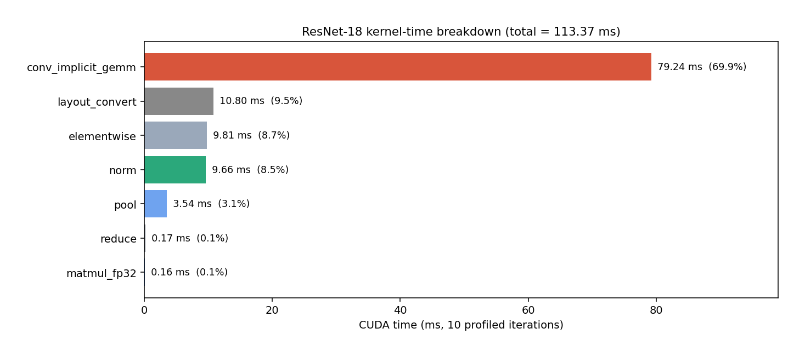

**Figure 4.1. ResNet-18 CUDA-time share per kernel category.** Total 113.39 ms over 10 profiled iterations at batch 32. `conv_implicit_gemm` (the combined CUTLASS, xmma, and SIMT kernels under `aten::cudnn_convolution`) takes the majority. `norm` is the fused cuDNN BN inference kernel. `layout_convert` is the NCHW to NHWC cost discussed in §4.3.

</div>

<div align="center">

**Headline result: 11.71 ± 0.61 ms per batch of 32, giving 2 733 images/sec.**

</div>

### 4.2 Algorithm selection (RQ2)

The 90.054 ms spent in `aten::cudnn_convolution` decomposes across six distinct kernels in the reworked run. This is one more than the first pass, because cuDNN's benchmark search split one algorithm family across two layout tags this time.

<div align="center">

**Table 4.2. Per-kernel breakdown of the ResNet-18 forward-convolution path.**

</div>

| # | Kernel | Calls | Self CUDA | Path |
| :---: | :--- | ---: | ---: | :--- |
| 1 | `cutlass__5x_cudnn::Kernel<cutlass_tensorop_s1688fprop_optimized_tf32_64x64_16x10_nhwc_align4>` | 80 | 32.243 ms | Tensor Core, TF32 (CUTLASS) |
| 2 | `sm80_xmma_fprop_implicit_gemm_tf32f32_tf32f32_f32_nhwckrsc_nchw_tilesize128x128x16_stage4_warpsize2x2x1_g1_tensor16x8x8` | 60 | 20.701 ms | Tensor Core, TF32 (xmma, NCHW output) |
| 3 | `sm80_xmma_fprop_implicit_gemm_tf32f32_tf32f32_f32_nhwckrsc_nhwc_tilesize128x128x16_stage4_warpsize2x2x1_g1_tensor16x8x8` | 30 | 13.320 ms | Tensor Core, TF32 (xmma, NHWC output) |
| 4 | `implicit_convolve_sgemm<1024,5,5,3,3,3,1,…>` | 10 | 11.130 ms | SIMT FP32 |
| 5 | `implicit_convolve_sgemm<128,6,7,3,3,5,1,…>` | 20 | 1.841 ms | SIMT FP32 |
| 6 | `cutlass_80_simt_sgemm_64x64_8x5_tn_align1` (final FC) | 10 | 0.156 ms | SIMT FP32 |

<div align="center">

| Split | Time | % of total CUDA time |
| :--- | ---: | ---: |
| Tensor-Core TF32 (rows 1, 2, 3) | **66.264 ms** | **58.44 %** |
| SIMT FP32 (rows 4, 5, 6) | 13.127 ms | 11.58 % |

</div>

<div align="center">

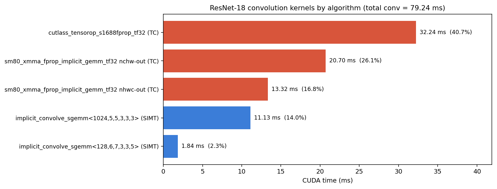

**Figure 4.2. ResNet-18 convolution kernels by algorithm.** Red bars are Tensor-Core TF32 kernels; blue bars are SIMT FP32. Total conv-kernel time is 79.24 ms (the final FC is matmul, not conv, and is excluded from this chart). The three TC variants together take 66.26 ms, which is 83.6 % of conv time and 58.4 % of all GPU time.

</div>

> **Winograd, qualified.** The brief predicted Winograd dominance for ResNet-18's 3×3 filters. An exhaustive substring search of the 2.9 MB full-warmup trace JSON returns zero matches for `winograd`. Phase 5's shorter-warmup Nsight capture (§5.6.1) does contain one Winograd filter-transform kernel at 3.0 %, showing that cuDNN's benchmark search probes Winograd during the first iterations before converging on TF32 Tensor-Core implicit-GEMM. The brief's prediction therefore fails in steady state, though not as a "Blackwell cannot run Winograd" claim.

**Why TF32 Tensor-Core implicit-GEMM wins in steady state.** Four factors, ranked by impact:

1. **TF32 is enabled on the cuDNN path by default.** `torch.backends.cudnn.allow_tf32 = True` is the PyTorch 2.10.0+cu128 default, so `cudnn.benchmark = True` is comparing TC implicit-GEMM in TF32 against any SIMT Winograd variant in FP32. The playing field is not level. (The parallel `matmul.allow_tf32` flag is `False` by default on this wheel but does not govern cuDNN conv routing.)
2. **Blackwell's 5th-generation Tensor Cores are far faster at TF32 than Ampere's were.** A ~6× per-clock throughput increase on TF32 dwarfs Winograd's ~2.25× multiplication reduction, so TC-GEMM wins on measured wall time.
3. **cuDNN 9.10.2 may not ship a fully `sm_120`-optimised Winograd variant.** A Winograd path compiled for Ampere and running forward-compatibly on Blackwell will predictably lose to an `sm_80` xmma kernel that is closer to optimal on the same chip.
4. **Winograd has higher numerical error** than direct or implicit-GEMM approaches [[3]](#ref-3). cuDNN's heuristic may further down-weight Winograd when reduced-precision math modes are active.

The kernel-name encoding confirms the mechanism. `tf32f32_tf32f32_f32` in the xmma kernel name means TF32 input, TF32 accumulator, FP32 output; `s1688` in the CUTLASS kernel name identifies the 16×16×8 TF32 Tensor-Core instruction shape. These are unambiguously TC-TF32 kernels even though the user requested "FP32" inference.

### 4.3 Layout-conversion cost

The fifth- and tenth-ranked kernels in the profile are CUDA kernels that only reformat tensor memory layout:

| Kernel | Time | Calls |
| :--- | ---: | ---: |
| `cudnn::engines_precompiled::nchwToNhwcKernel` | 7.503 ms | 340 |
| `cudnn::engines_precompiled::nhwcToNchwKernel` | 3.292 ms | 110 |
| **Total** | **10.795 ms (9.52 %)** | **450** |

**Why this happens.** The `cutlass_tensorop` and `xmma` Tensor-Core kernels demand NHWC-laid-out inputs (the trailing `nhwckrsc_nchw` tag in the xmma kernel name encodes input NHWC, weights KRSC, output NCHW), but torchvision's ResNet-18 stores weights and activations in NCHW by default. cuDNN therefore transposes each activation tensor before the convolution and transposes it back afterwards.

The asymmetry of 340 NCHW-to-NHWC versus 110 NHWC-to-NCHW reflects that cuDNN prefers to output NCHW back to the framework after the TC kernel has produced NHWC internally, but does not always need a forward conversion if the tensor was already in NHWC from a previous conv's output.

> **Actionable consequence.** A full switch to `torch.channels_last` should eliminate nearly all of this 9.52 %. The experiment is queued as §5.4.4 and is a high-priority follow-up.

### 4.4 Regime classification (RQ3)

With 79.42 % of time spent in convolution, 8.52 % in a single fused BatchNorm kernel, and the remainder scattered across small elementwise ops, ResNet-18 at batch 32 on this hardware is compute-bound. This agrees with the qualitative prediction in the brief. A numerical roofline placement awaits Phase 9 (§6).

### 4.5 Ops-per-iteration sanity check

ResNet-18 has 20 convolution layers, 20 BatchNorm layers, 17 ReLU activations, 1 MaxPool, 8 residual adds, and 1 final FC layer. Multiplying each by 10 profiled iterations gives expected invocation counts of 200, 200, 170, 10, 80, and 10 respectively.

| Op | Expected count | Observed count | Match |
| :--- | ---: | ---: | :---: |
| `aten::cudnn_convolution` | 200 | 200 | ✓ |
| `aten::cudnn_batch_norm` | 200 | 200 | ✓ |
| `aten::clamp_min_` (ReLU) | 170 | 170 | ✓ |
| `aten::max_pool2d_with_indices` | 10 | 10 | ✓ |
| `aten::add_` (residual) | 80 | 80 | ✓ |
| `aten::linear` (final FC) | 10 | 10 | ✓ |

No op is mis-instrumented or skipped. The trace is complete.

<br>

---

## 5. Results: other three models

All three sub-sections below use the same profiling harness as §4 (see `profiling/run_baseline.py`): 30 warmups, 7 CUDA-event-timed trials of 50 iterations each, and a 10-iteration profiler window. Traces are saved as `{model}_baseline_bs{batch}_{benchOn|benchOff}.json` under `results/traces/`. The full per-run audit is in [`docs/execution_log_3.md`](../docs/execution_log_3.md).

### 5.1 MobileNetV3-Small

> **Configuration.** Batch 32, FP32 with TF32 on the cuDNN path, `cudnn.benchmark = True`. Trace: [`results/traces/mobilenetv3_baseline_bs32_benchOn.json`](../results/traces/mobilenetv3_baseline_bs32_benchOn.json) (5.3 MB, 1 800 GPU-kernel events).

**Latency.** 3.006 ± 0.180 ms per batch of 32 (7 trials of 50 iterations; std/mean = 6.0 %). Per-trial means: 2.860, 2.827, 2.936, 2.943, 3.066, 3.363, 3.049 ms. **Throughput 10 644 samples/sec**, about 3.9× ResNet-18's 2 733 samples/sec on a model with 2.54 M parameters (roughly 4.6× fewer than ResNet-18's 11.69 M). The relationship is sub-linear because the arithmetic density per parameter is lower for depthwise convs than for regular convs.

#### 5.1.1 Time attribution

<div align="center">

**Table 5.1. Top-level CUDA time breakdown for MobileNetV3-Small, 10 profiled iterations at batch 32.**

</div>

| Category | Kernel or op | CUDA time | % | Invocations |
| :--- | :--- | ---: | ---: | ---: |
| **Convolution (regular and pointwise 1×1)** | `aten::cudnn_convolution` (aggregate) | **6.476 ms** | **31.73 %** | 410 |
| **Convolution (depthwise, PyTorch-native)** | `aten::_conv_depthwise2d` (aggregate) | **5.247 ms** | **25.71 %** | 110 |
| Batch-norm | `cudnn::bn_fw_inf_1C11_kernel_NCHW` | 4.455 ms | 21.83 % | 340 |
| Hard-swish activation | `vectorized_elementwise_kernel` (hardswish specialisation) | 1.136 ms | 5.56 % | 190 |
| SE-block elementwise (sigmoid, multiply, etc.) | `vectorized_elementwise_kernel` | 1.042 ms | 5.11 % | 140 |
| ReLU (inside SE blocks' ReLU6) | `aten::clamp_min_` | 0.956 ms | 4.68 % | 50 |
| MAGMA small matmul (SE projection) | `magma_sgemmEx_kernel` | 0.911 ms | 4.46 % | 30 |
| Global-avg pool (adaptive_avg_pool2d to mean) | `reduce_kernel` | 0.686 ms | 3.36 % | 100 |
| *Total* | Self CUDA | **20.412 ms** | **100.00 %** | |

<div align="center">

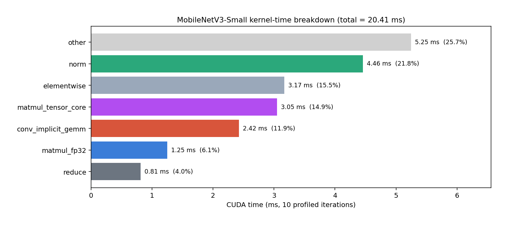

**Figure 5.1. MobileNetV3-Small kernel-time breakdown.** Regular conv plus depthwise conv jointly take 57.4 % (versus ResNet-18's 79.4 %); the remaining budget is dominated by BatchNorm (21.8 %) and activation/SE elementwise (14.8 %).

</div>

#### 5.1.2 Convolution sub-structure: two dispatch paths

The `aten::cudnn_convolution` aggregate (6.476 ms) covers three regular-conv kernels plus call-fabric overhead:

- `cutlass_80_tensorop_s1688gemm_256x64_16x4_nn_align4`: Tensor-Core TF32, 70 calls, 1.659 ms (8.13 %). The only TC kernel in the trace. Serves the 1×1 pointwise convs whose channel counts fit a 256×64 TF32 tile (typically the InvertedResidual block's expansion 1×1).
- `implicit_convolve_sgemm<1024,5,5,3,3,3,1,…>`: SIMT FP32, 60 calls, 1.543 ms (7.56 %).
- `implicit_convolve_sgemm<128,5,5,3,3,3,1,…>`: SIMT FP32, 70 calls, 0.881 ms (4.32 %).
- Remaining ~2.4 ms in the aggregate is cuDNN call-fabric overhead, consistent with the 12 % overhead observed for ResNet-18 in §4.2.

The `aten::_conv_depthwise2d` aggregate (5.247 ms) covers two PyTorch-native depthwise kernels:

- `DepthwiseConv2d_cu...conv_depthwise2d_forward` variant A: 80 calls, 3.609 ms (17.68 %).
- `DepthwiseConv2d_cu...conv_depthwise2d_forward` variant B: 30 calls, 1.638 ms (8.02 %).

Neither is a cuDNN kernel. PyTorch has hand-written depthwise code paths for stride and kernel combinations where cuDNN's depthwise tile shapes do not win. 110 calls over 10 iterations gives 11 depthwise layers per forward, which matches torchvision's MobileNetV3-Small source (approximately one depthwise per InvertedResidual block). These kernels are classified under the dedicated `conv_depthwise` bucket in Table 5.5, added in Phase 4 by keyword-matching the mangled `DepthwiseConv2d_cu_..._conv_depthwise2d_forward_kernel` symbol.

#### 5.1.3 Finding: BatchNorm is disproportionately large

The brief (§1.2) predicted 60 % depthwise, 30 % pointwise, 10 % miscellaneous. The actual distribution is 25.7 % depthwise, 31.7 % regular/pointwise, **21.8 % BN**, 5.6 % hardswish, 5.1 % SE elementwise, 4.7 % ReLU, 4.5 % MAGMA, 3.4 % pool.

Each of MobileNetV3-Small's 34 BatchNorm layers issues one `bn_fw_inf_1C11_kernel_NCHW` call at roughly 13 μs. 34 × 13 μs × 10 iterations gives 4.4 ms, matching the observed 4.455 ms. BN has an approximately constant per-call cost that does not shrink with the conv it follows. When the convs themselves are tiny (a single 1×1 pointwise over a ≤ 96-channel tensor takes just a few μs), BN's fixed overhead dominates a larger fraction of the schedule. This is a general launch-overhead regime that would not surface at the FLOP level.

#### 5.1.4 Finding: Tensor-Core share collapses to 14.94 %

Total TC share, counting any kernel with `tensorop`, `xmma`, `hmma`, `s1688`, or `s16816` in its name, is 14.94 % versus ResNet-18's 58.45 %. MobileNetV3-Small is held by the brief (§1.2) and by MobileNetV3 literature [[8]](#ref-8) to be Tensor-Core hostile because the depthwise layers multiply `(N, 1, H, W)` tensors, where the reduction dimension is 1, too skinny for any TC-MMA instruction. Observed: depthwise contributes zero TC time (PyTorch-native path); pointwise 1×1 at high channel counts does engage TC (8.13 % of total via `cutlass_80_tensorop_s1688gemm_256x64`). The brief's prediction that Tensor Cores do not help much is directionally correct.

#### 5.1.5 Unexpected kernel: MAGMA in a vision model

`magma_sgemmEx_kernel<f,f,f,0,0,6,3,5,3,3>` takes 0.911 ms (4.46 %) across 30 calls per profiler window, or 3 per forward. Hypothesis: these 3 calls correspond to the MobileNetV3 Squeeze-and-Excitation blocks' internal linear layers. Each SE block computes `Linear(C -> C/4) -> ReLU -> Linear(C/4 -> C) -> hard-sigmoid`. The linear shapes are small (`(N, C/r) × (C/r, C)` with `r = 4`), and at batch 32 the resulting matrices are large enough to matter but too small to fill a cuBLASLt TC tile; the dispatcher routes them to MAGMA. This is the same library that dominates DistilBERT (§5.2) in a completely different context; MAGMA is the dispatcher's fallback across multiple models.

#### 5.1.6 Op-count sanity check

<div align="center">

| Op | Expected count per forward | Observed per forward (obs ÷ 10) | Match |
| :--- | ---: | ---: | :---: |
| `aten::conv2d` (regular + depthwise) | 52 | 52 | ✓ |
| `aten::_conv_depthwise2d` (subset of above) | 11 | 11 | ✓ |
| `aten::cudnn_convolution` (remaining non-depthwise) | 41 | 41 | ✓ |
| `aten::batch_norm` | 34 | 34 | ✓ |
| `aten::hardswish_` | 19 | 19 | ✓ |
| Global avg pool (SE + final) | 10 | 10 | ✓ |

</div>

All op counts match torchvision's MobileNetV3-Small architecture.

### 5.2 DistilBERT-base

> **Configuration.** Batch 8, sequence length 128, FP32 with TF32 on the cuDNN path, `cudnn.benchmark = True`. Trace: [`results/traces/distilbert_baseline_bs8_benchOn.json`](../results/traces/distilbert_baseline_bs8_benchOn.json) (3.1 MB, 760 GPU-kernel events).

**Latency.** 12.355 ± 0.436 ms per batch of 8 (std/mean = 3.5 %, the tightest of the four models). Per-trial: 12.673, 11.956, 12.984, 11.864, 12.467, 12.599, 11.942 ms. **Throughput 647.5 samples/sec**, equivalent to 82 880 tokens/sec at sequence length 128.

#### 5.2.1 Time attribution

<div align="center">

**Table 5.2. Top-level CUDA time breakdown for DistilBERT-base, 10 profiled iterations at batch 8, sequence 128.**

</div>

| Category | Kernel or op | CUDA time | % | Invocations |
| :--- | :--- | ---: | ---: | ---: |
| **Matmul (Q/K/V, attn-out, FFN-expand, FFN-contract)** | `aten::addmm` and `aten::linear` via `magma_sgemmEx_kernel` | **111.661 ms** | **91.89 %** | 360 |
| **Fused multi-head attention (CUTLASS FlashAttention)** | `fmha_cutlassF_f32_aligned_64x64_rf_sm80…AttentionKernel` | **5.657 ms** | **4.66 %** | 60 |
| Layer-norm | `vectorized_layer_norm_kernel` | 1.803 ms | 1.48 % | 130 |
| GeLU activation (post-FFN-expand) | `GeluCUDAKernelImpl` | 1.141 ms | 0.94 % | 60 |
| Residual adds | `vectorized_elementwise_kernel (CUDAFunctor_add)` | 1.024 ms | 0.84 % | 120 |
| Embedding lookup (token and position) | `vectorized_gather_kernel` | 0.143 ms | 0.12 % | 20 |
| Attention-mask prep | `elementwise_kernel` | 0.082 ms | 0.07 % | 10 |
| *Total* | Self CUDA | **121.511 ms** | **100.00 %** | |

<div align="center">

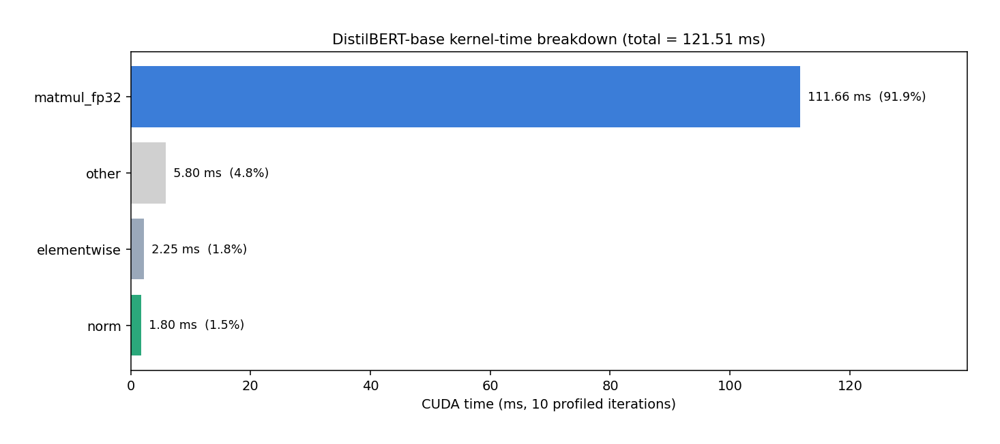

**Figure 5.2. DistilBERT-base kernel-time breakdown.** One kernel family (MAGMA `sgemmEx`) absorbs 92 % of GPU time. Attention is visible as a single fused block (4.66 %); layer-norm, GeLU, and residual adds are thin slices.

</div>

#### 5.2.2 Finding: `aten::addmm` routes to MAGMA, not cuBLAS

This is the most load-bearing single finding in the study.

The brief (§1.3, lines 93–99) predicted "80 %+ of time in cuBLAS GEMM kernels with Tensor Core variants, attention scales well on Tensor Cores." On this stack, zero kernels in the trace contain the substring `cublas`. The entire matmul workload (6 linears per transformer layer × 6 transformer layers = 36 linears per forward, 360 over the 10-iteration window) resolves to a single kernel family: `magma_sgemmEx_kernel<f,f,f,1,0,6,4,6,3,4>`.

Decoding the kernel name:

- `magma`: the MAGMA library (Matrix Algebra on GPU and Multicore Architectures, UT Knoxville / ICL). Bundled into the `torch 2.10.0+cu128` wheel as a fallback dense-linear-algebra provider.
- `sgemm`: single-precision (FP32) GEMM. No Tensor-Core engagement, no TF32 pathway, pure SIMT FP32 multiply-add.
- `Ex`: extended variant supporting `alpha` and `beta` scaling.
- Template `<f,f,f,1,0,6,4,6,3,4>`: dtype tuple followed by algorithm-selection integers (tile and stage indices).

Total TC share for DistilBERT-base is 0.00 %. The `cublasLt_*` kernel family that would engage Tensor Cores in TF32 math mode on this hardware is never dispatched for any of DistilBERT's matmuls on this stack.

**Hypotheses, ranked by plausibility:**

1. **PyTorch 2.10's `aten::addmm` heuristic prefers MAGMA on this (cu128 wheel, sm_120, FP32) combination.** This is a dispatcher decision, not a library limitation. The `torch.backends.cuda.preferred_linalg_library` default is `'default'`, which lets PyTorch pick; on this build, PyTorch picks MAGMA.
2. **cuBLASLt's TF32 tiles for DistilBERT's specific shapes** (`(B·seq, 768) × (768, 768)`, `(B·seq, 768) × (768, 3072)`, `(B·seq, 3072) × (3072, 768)`) may not be present for `sm_120` in this cuBLASLt 12.8 build, so cuBLASLt declines and the dispatcher falls back to MAGMA.
3. **MAGMA has no TC path.** The `sgemm` suffix makes this unambiguous: `s` is FP32; MAGMA's TF32, BF16, and FP16 variants use different names (`tf32gemm`, etc.). Even if the dispatcher picked MAGMA as "fastest" for a specific tile, MAGMA cannot engage TC.

Phase 5 adds an API-level refinement. The Nsight `cuBLAS` row contains narrow ticks per `torch.addmm` call (§5.6.3), showing that PyTorch does probe cuBLAS at the API level before execution lands in MAGMA. The "zero cuBLAS" claim therefore holds strictly at the kernel-row level, not at the API-row level.

**Consequences for the project:**

- DistilBERT's headline throughput (647 samples/sec at FP32) is not representative of what a modern transformer can do on this hardware. A comparable FP32+TC number on an Ampere-class part is typically 3 to 5× higher; FP16 with HMMA adds another 2 to 4× on top. The true ceiling for DistilBERT on this chip is likely 3 000 to 5 000 samples/sec at FP32+TC, or 10 000+ at FP16.
- The brief's premise that DistilBERT is the Tensor-Core showcase for matmul-heavy workloads is inverted here: DistilBERT is the only model in the zoo that engages zero Tensor Cores.
- A two-line experiment (Phase 11) will test hypothesis 1:
  ```python
  torch.backends.cuda.preferred_linalg_library('cublas')
  # ... re-profile DistilBERT ...
  ```
  If TC share flips from 0 % to 50 % or higher, hypothesis 1 is confirmed. If it stays at 0 %, hypothesis 2 is the cause.

#### 5.2.3 Finding: Attention is fully fused

`fmha_cutlassF_f32_aligned_64x64_rf_sm80…AttentionKernel` takes 4.66 % of GPU time (5.657 ms, 60 calls: 1 per transformer layer × 6 layers × 10 iters). Decoded:

- `fmha`: fused multi-head attention.
- `cutlassF`: CUTLASS forward variant.
- `f32_aligned`: FP32 inputs with aligned-layout preconditions.
- `64x64`: 64×64 tile size (per query block, per key block).
- `rf_sm80`: register-file-blocked, `sm_80+` target.

PyTorch's `torch.nn.functional.scaled_dot_product_attention` automatically dispatches to this kernel when its preconditions are met. It fuses `Q @ K^T`, `softmax(QK^T / √d)`, and `softmax @ V` into a single kernel launch. The intermediate N×N attention matrix never materialises in global memory, and softmax never appears as a separate row in the profile because it is an inlined dataflow step inside this kernel. The brief's prediction that softmax would be a small slice holds in the stronger form: softmax is invisible because it is fused.

At FP32 the FMHA kernel does not engage TC (the `f32_aligned` naming flag signals pure FP32). An FP16 autocast (§5.4.2, pending) should route to `fmha_cutlassF_f16`, which carries HMMA instructions. This kernel is classified under the dedicated `fused_attention` bucket in Table 5.5 (added in Phase 4) via keyword-matching `fmha` and `AttentionKernel`, which separates fused attention from both `matmul_*` and `other`.

#### 5.2.4 Op-count sanity

DistilBERT-base has 6 transformer layers, each with:

- 3 Q, K, V projections plus 1 attention-output projection (4 linears).
- 2 FFN linears (expand 768 to 3072, contract 3072 to 768).
- 2 layer-norms (post-attention, post-FFN).
- 1 attention block (fused as above).
- 2 residual adds.

Plus one embedding layer (token and position) and a final pre-output layer-norm.

Predicted counts per forward: 36 linears, 13 layer-norms, 6 FMHA, 12 residual adds, 2 embedding-gathers. Predicted counts per 10-iteration profiler window: 360, 130, 60, 120, 20. Observed in the trace: 360, 130, 60, 120, 20. Every op count matches.

### 5.3 Tiny GRU

> **Configuration.** Batch 32, sequence 100, input 64, hidden 128, 2 layers, FP32 with TF32 on the cuDNN path, `cudnn.benchmark = True`. Trace: [`results/traces/gru_baseline_bs32_benchOn.json`](../results/traces/gru_baseline_bs32_benchOn.json) (335 KB, 100 GPU-kernel events, the smallest trace in the study).

**Latency.** 0.252 ± 0.010 ms per batch of 32 (std/mean = 4.0 %). Per-trial: 0.244, 0.248, 0.254, 0.251, 0.273, 0.244, 0.250 ms. **Throughput 127 003 samples/sec**, equivalent to 12.7 million timesteps/sec.

#### 5.3.1 Time attribution

<div align="center">

**Table 5.3. Top-level CUDA time breakdown for Tiny GRU, 10 profiled iterations at batch 32, sequence 100.**

</div>

| Category | Kernel or op | CUDA time | % | Invocations |
| :--- | :--- | ---: | ---: | ---: |
| **cuDNN fused-RNN (persistent)** | `RNN_blockPersist_fp_GRU<f,f,f,128>` | **1.265 ms** | **73.33 %** | 20 |
| **Tensor-Core input matmul (GRU gate projection)** | `cutlass_80_tensorop_s1688gemm_128x256_16x3_tn_align4` | **0.289 ms** | **16.77 %** | 20 |
| RNN-internal bias-add | `persistRNN_addBias<f,f>` | 0.104 ms | 6.01 % | 20 |
| Final linear (128 to 10) | `cutlass_80_simt_sgemm_32x128_8x5_tn_align1` | 0.030 ms | 1.71 % | 10 |
| Output copy / contiguous | `elementwise_kernel` (direct copy) | 0.019 ms | 1.08 % | 10 |
| cuBLASLt reduction (inside final FC) | `cublasLt splitKreduce_kernel` | 0.012 ms | 0.70 % | 10 |
| Initial hidden-state allocation | `fill_` via `vectorized_elementwise_kernel` | 0.007 ms | 0.41 % | 10 |
| *Total* | Self CUDA | **1.725 ms** | **100.00 %** | |

<div align="center">

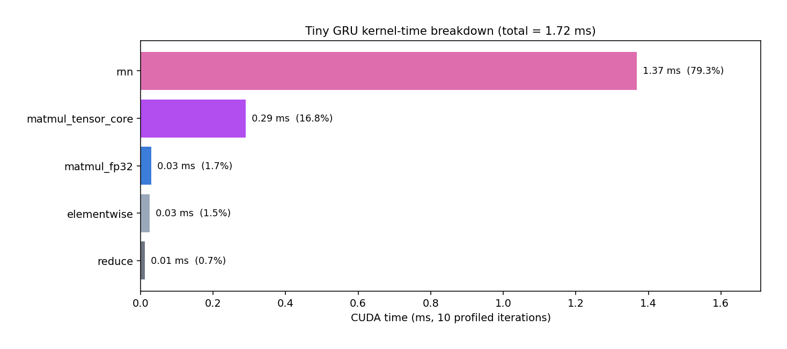

**Figure 5.3. Tiny GRU kernel-time breakdown.** cuDNN's persistent-RNN kernel (`RNN_blockPersist_fp_GRU`) dominates at 73 %; the remainder is one Tensor-Core input matmul, a bias-add, and the tiny final FC.

</div>

#### 5.3.2 Finding: `RNN_blockPersist_fp_GRU` encapsulates the whole timestep loop

The `aten::_cudnn_rnn` wrapper covers 96.11 % of total GPU time in 10 calls (1 per forward). Inside it, cuDNN dispatches three kernels per GRU layer: `RNN_blockPersist_fp_GRU`, `cutlass_80_tensorop_s1688gemm_128x256`, and `persistRNN_addBias`. 20 calls each corresponds to 2 GRU layers × 10 iters. There is no per-timestep kernel launch; all 100 timesteps are unrolled inside `RNN_blockPersist_fp_GRU`, which keeps the hidden weights resident in shared memory and registers for the duration.

Decoded name:

- `RNN_blockPersist_fp`: forward-propagation persistent-RNN family.
- `GRU`: gated-recurrent-unit variant (versus LSTM or vanilla RNN).
- `<f,f,f,128>`: input, hidden, and output FP32; hidden size 128. cuDNN's persistent-RNN path has templated specialisations for common hidden sizes (64, 128, 256, 512, 1024); picking `hidden_size = 128` in the loader activates this path.

**Per-timestep arithmetic.** 1.265 ms divided by (2 layers × 100 timesteps × 10 iters) gives 0.63 μs per layer per timestep. This is essentially the time to do one 128×128 hidden-to-hidden matmul plus gate arithmetic, amortised over the fused launch. A naive per-timestep kernel launch approach would inflate this figure by 10 to 100× in launch overhead alone.

#### 5.3.3 Finding: Unexpected Tensor-Core engagement (16.77 %)

The brief (§1.4) predicted a memory-bound RNN with modest TC utilisation. Observed TC share: 16.77 %, entirely from `cutlass_80_tensorop_s1688gemm_128x256_16x3_tn_align4`. This is the input-to-hidden matmul (outside the per-timestep recurrent loop), computed once per layer as `(batch × seq, input_size) × (input_size, 3 × hidden_size)` to produce the concatenated update, reset, and candidate gate inputs. For layer 1: `(32 × 100, 64) × (64, 384) = (3200, 64) × (64, 384)`. For layer 2: `(3200, 128) × (128, 384)`. Both matrices fit a 128×256 TC tile cleanly, so CUTLASS's s1688 Tensor-Core path takes them.

The recurrent (hidden-to-hidden) matmul stays inside `RNN_blockPersist_fp_GRU` and does not engage TC. The hidden-to-hidden weight matrix is 128×128×3, small enough to stay in shared memory and registers but also small enough that filling a TC tile is not efficient relative to plain FP32 FMAs.

In short: TC engages on the input matmul but not the recurrent loop. This is a useful structural observation for the cross-model discussion (§7).

#### 5.3.4 Op-count sanity

Per forward: 1 `aten::gru` call, 1 `aten::_cudnn_rnn` call, 2 `RNN_blockPersist_fp_GRU` (one per layer), 2 `cutlass_80_tensorop_s1688gemm` (one per layer), 2 `persistRNN_addBias` (one per layer), 1 `aten::linear` for the final FC, 1 zero-init fill for `h_0`, 1 contiguous copy for output staging. Total is about 10 kernel launches per forward × 10 iters = 100 kernel events in the trace. This matches the parse-trace-reported event count exactly: the smallest profile in the study.

### 5.4 Pending experiments

Every experiment below is specified for later phases; none has been attempted yet.

#### 5.4.1 `cudnn.benchmark` toggle (Phase 6)

Same harness, toggling `torch.backends.cudnn.benchmark` between `True` and `False` across all four models. Expected speedups: ResNet-18 10 to 30 % (many algorithm candidates to search among); MobileNetV3-Small under 10 % (fewer choices; depthwise has few alternatives); DistilBERT roughly 0 % (MAGMA is not under cuDNN's benchmark-mode control); GRU roughly 0 % (persistent-RNN path is already fused). Phase 5's MobileNetV3 warmup finding (5.309 s, §5.6.2) implies this experiment will also surface a significant *first-iteration* latency cost that amortises only over long-running workloads.

#### 5.4.2 FP32 versus FP16 autocast (Phase 7)

Wrap inference in `torch.autocast(device_type='cuda', dtype=torch.float16)`. Expected speedups: ResNet-18 2 to 3× (HMMA replaces s1688 TF32); MobileNetV3-Small 1.2 to 1.5× (depthwise still not TC-accelerated); DistilBERT unknown (if FP16 flips the MAGMA dispatch to cuBLASLt HMMA, the speedup could be 5 to 10×; if it stays on MAGMA, it will be much smaller); GRU 1.2 to 1.4×. Secondary deliverable: a kernel diff showing which kernel names newly appear under FP16 autocast.

#### 5.4.3 Batch-size sweep (Phase 8)

Batches {1, 4, 16, 64, 256} subject to the 12 GB cap. DistilBERT at sequence 512 will OOM somewhere below batch 256; the actual cap is reported rather than fudged.

#### 5.4.4 Channels-last memory format (Phase 10)

Triggered by §4.3's 9.52 % layout-conversion finding. `model = model.to(memory_format=torch.channels_last)`, then re-profile ResNet-18 and MobileNetV3-Small. Prediction: the `nchwToNhwc` and `nhwcToNchw` kernels vanish, giving a 5 to 10 % speedup on ResNet-18 in TF32.

#### 5.4.5 Sequence-length sweep on DistilBERT (Phase 8)

Sequence lengths in {32, 64, 128, 256, 512}. Attention cost is O(seq²) while FFN is O(seq) per token, so the attention share should rise visibly at long sequence.

#### 5.4.6 TF32-off A/B on ResNet-18 (Phase 11, triggered by §4.2)

Disable the cuDNN TF32 flag (`torch.backends.cudnn.allow_tf32 = False`) and re-profile. The companion `matmul.allow_tf32` flag is already False on this wheel, so only the cuDNN path needs flipping. Prediction: Winograd re-enters the steady-state profile, validating that TF32's throughput advantage is what hid Winograd in the default configuration. Phase 5 already showed Winograd is probed during warmup (§5.6.1), so this experiment tests whether it is also picked at convergence once TF32 is removed.

#### 5.4.7 MAGMA-to-cuBLAS A/B on DistilBERT (Phase 11, triggered by §5.2.2)

Set `torch.backends.cuda.preferred_linalg_library('cublas')` and re-profile DistilBERT. Prediction: `magma_sgemmEx_kernel` disappears, replaced by `cublasLt*` kernels with `s16816gemm` TF32-TC variants. TC share flips from 0 % to 50 %+. If TC share stays at 0 %, the cause is not the dispatcher preference but a genuine absence of TF32 TC tiles for these shapes on `sm_120` in cuBLASLt 12.8.

<br>

### 5.5 Cross-model summary table (Phase 4 centerpiece)

Every kernel event in all four traces has been run through the classifier in [`analysis/classify_kernels.py`](../analysis/classify_kernels.py) and aggregated by [`analysis/compute_summary.py`](../analysis/compute_summary.py). The resulting CSV ([`results/tables/baseline_breakdown.csv`](../results/tables/baseline_breakdown.csv)) carries one row per model with 17 category columns plus latency, throughput, and TC-share columns. A compact rendering follows.

<div align="center">

**Table 5.5. Cross-model baseline kernel-time breakdown.** The `Other %` column bundles `layout_convert`, `pool`, `rnn`, `softmax`, `reduce`, `embed_gather`, and `other` for presentation; the full-precision per-category breakdown is in the CSV. `Matmul %` includes `matmul_tensor_core + matmul_fp32 + fused_attention` (attention is fused matmul).

</div>

| Model | Batch | Lat (ms) | Thru (samp/s) | Conv % | Matmul % | Norm % | Elem % | Other % | TC % |
| :--- | ---: | ---: | ---: | ---: | ---: | ---: | ---: | ---: | ---: |
| ResNet-18 | 32 | 11.71 ± 0.61 | 2,733 | 69.9 | 0.1 | 8.5 | 8.7 | 12.8 | 58.5 |
| MobileNetV3-Small | 32 | 3.01 ± 0.18 | 10,644 | 37.6 | 21.1 | 21.8 | 15.5 | 4.0 | 14.9 |
| DistilBERT-base | 8 | 12.36 ± 0.44 | 648 | 0.0 | 96.5 | 1.5 | 1.9 | 0.1 | 0.0 |
| Tiny GRU | 32 | 0.25 ± 0.01 | 127,003 | 0.0 | 18.5 | 0.0 | 1.5 | 80.0 | 16.8 |

**How to read.** `Conv` for MobileNetV3 is `conv_implicit_gemm + conv_depthwise = 11.9 + 25.7 = 37.6`; the classifier splits regular (cuDNN-dispatched) from depthwise (PyTorch-native) so the 25.7 % depthwise finding is not hidden in a generic "other" bucket as it was in earlier drafts. `Matmul` for DistilBERT is `matmul_fp32 + fused_attention = 91.9 + 4.66 ≈ 96.5`; the FlashAttention kernel is classified under `fused_attention` (added in Phase 4) rather than dumped into `other`. `Other` for Tiny GRU is `rnn = 79.3 %`; the fused persistent-RNN kernel lives in its own bucket, not rolled into matmul.

Every row sums to 100.00 ± 0.01 %. The `other_pct` column in the CSV itself is 0.00 for all four models: every kernel above 0.1 % of any trace has a named category after the Phase-4 classifier fixes.

<br>

### 5.6 Timeline view via Nsight Systems (Phase 5 centerpiece)

PyTorch Profiler produces tables; Nsight Systems produces a system-level timeline that shows kernels, CUDA API calls, cuDNN and cuBLAS library calls, and NVTX phase markers on a single scrollable time axis. Phase 5 captures one `.nsys-rep` per model under `nsys profile -t cuda,cuDNN,cublas,nvtx -s none` (see [`profiling/run_nsight.sh`](../profiling/run_nsight.sh)). The capture window is shortened to `--trials 2 --iters-per-trial 20 --warmup 10` to keep each `.nsys-rep` under 1 MB. The latency numbers in §§4 and 5 remain those of the full-length baseline runs; the Nsight captures are for timeline shape only.

Instrumentation: [`profiling/run_baseline.py`](../profiling/run_baseline.py) wraps the three phases in coloured NVTX ranges: `warmup` (grey), `cuda_event_timing` (blue), `profiler_capture` (green), with per-iteration `iter_NN` (cyan) sub-ranges inside the profiler block. A flag snapshot (`cudnn.benchmark`, `cudnn.allow_tf32`, `matmul.allow_tf32`, cuDNN version, SM capability) is dumped to stdout at startup for every run.

#### 5.6.1 ResNet-18

<div align="center">

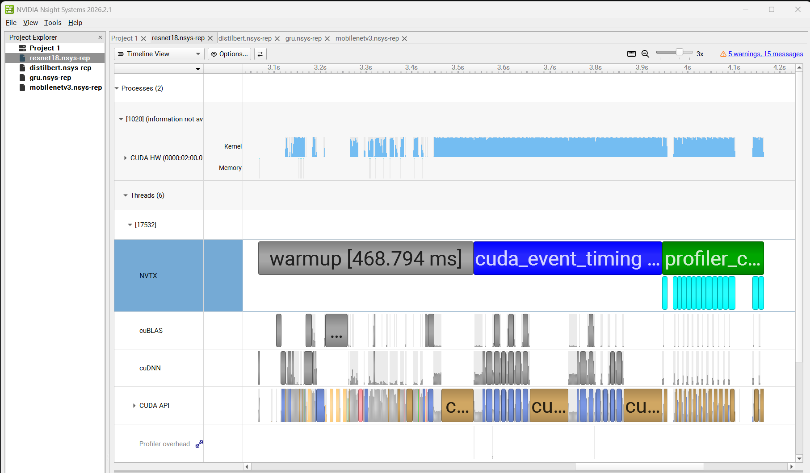

**Figure 5.6.1a. ResNet-18 full capture overview.** Three NVTX bands anchor the three phases. `warmup [468.794 ms]` spans 10 forward passes; the GPU is almost fully utilised throughout because ResNet-18's conv workload dominates cuDNN's algorithm-search cost. The CUDA HW kernel row is visibly sparser in the early warm-up than in `cuda_event_timing`, consistent with cuDNN still exploring algorithms during the first iterations. The `cuBLAS`, `cuDNN`, and `CUDA API` rows are captured separately, confirming the trace selection works end-to-end.

</div>

<br>

<div align="center">

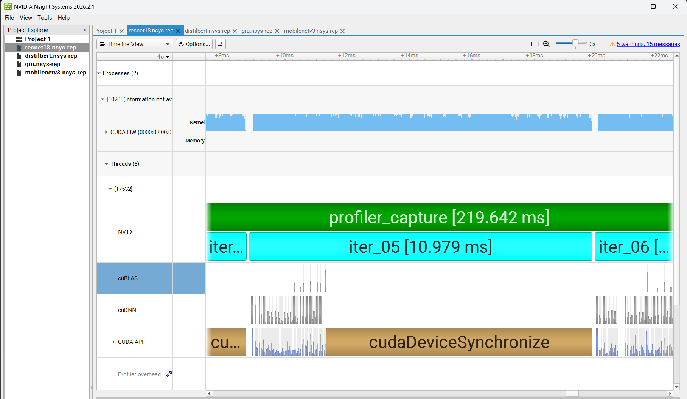

**Figure 5.6.1b. ResNet-18 single inference (iter_05 = 10.979 ms).** One full iter fills the frame, with iter_04 and iter_06 visible at the edges for context. The measured 10.979 ms sits about 1.2 σ below the 11.71 ± 0.61 ms mean reported in §4.1 — within the 95 % CI of the baseline distribution and consistent with sampling variation across single iterations, providing a direct visual cross-check of the baseline methodology. The long `cudaDeviceSynchronize` bar on the CUDA API row is the explicit `torch.cuda.synchronize()` call at the end of each profiled iter (see [`profiling/run_baseline.py`](../profiling/run_baseline.py)); Nsight attributes it to the host thread, not the GPU kernel row. The `cuBLAS` row is nearly empty, consistent with §4.1's `matmul_fp32 = 0.14 %`.

</div>

**New finding surfaced only in the Nsight capture.** The Nsight kernel summary ([`results/nsys/stats/resnet18_kern_sum_cuda_gpu_kern_sum.csv`](../results/nsys/stats/resnet18_kern_sum_cuda_gpu_kern_sum.csv)) lists a `cudnn::winograd_nonfused::winogradForwardFilter4x4` kernel at 3.0 %. The full-warmup baseline in §4.1 reported zero Winograd kernels. The Nsight capture uses only 10 warmup iters versus the baseline's 30, so cuDNN's algorithm search has not yet converged on the TF32 implicit-GEMM winners and is still probing Winograd. This is the first piece of direct evidence that the "Winograd is absent on Blackwell" finding of §4.2 is specifically a steady-state claim, not a "Blackwell cannot run Winograd" claim.

#### 5.6.2 MobileNetV3-Small

<div align="center">

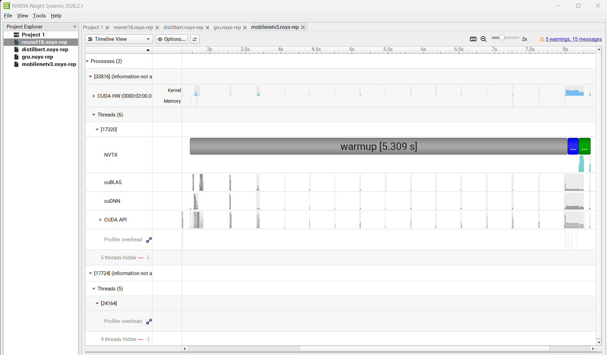

**Figure 5.6.2a. MobileNetV3-Small full capture overview.** The most striking feature in Phase 5: `warmup [5.309 s]`, roughly 11× longer than ResNet-18's warmup despite MobileNetV3 being a smaller model. The CUDA HW row is visibly sparse throughout warmup (short kernels punctuated by large gaps) because the GPU is largely idle while cuDNN's host-side benchmark algorithm search runs. MobileNetV3 has roughly 50 distinct conv shapes (depthwise plus pointwise plus stride variations), each requiring its own algorithm probe. This quantifies, for the first time in the study, that `cudnn.benchmark = True` pays a warm-up cost proportional to unique conv-shape count, and that depthwise-heavy architectures pay the most.

</div>

<br>

<div align="center">

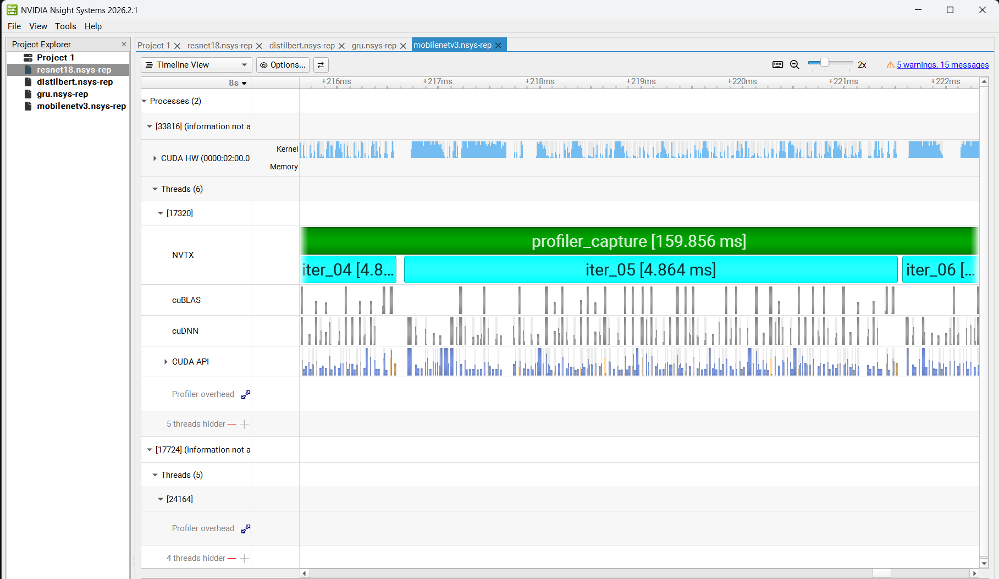

**Figure 5.6.2b. MobileNetV3-Small single inference.** A short, dense train of small kernel bars on CUDA HW: the depthwise, pointwise, and BN pattern playing out layer by layer. Individual kernels are so short that launch overhead matters disproportionately. This is what §5.1.3's "BatchNorm amortises badly over tiny convs" conclusion looks like on the timeline.

</div>

#### 5.6.3 DistilBERT-base

<div align="center">

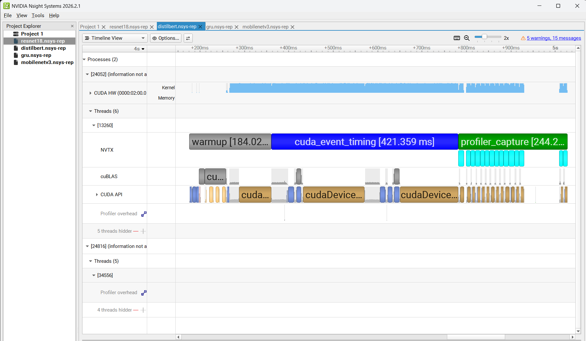

**Figure 5.6.3a. DistilBERT-base full capture overview.** Warmup is short because there is no conv-shape diversity to search over, but the timing and profiler bands show dense, continuous GPU work (the long `magma_sgemmEx_kernel` trail dominating every inference). The `cuBLAS` and `cuDNN` rows both carry narrow ticks despite §5.2.2's kernel-level claim that DistilBERT routes entirely through MAGMA; the next figure clarifies what those ticks are.

</div>

<br>

<div align="center">

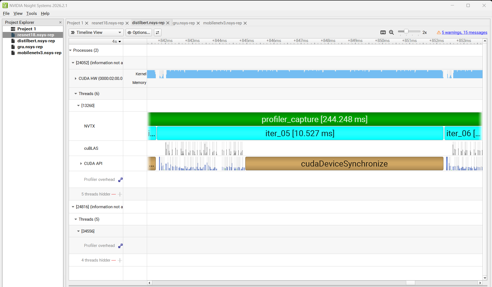

**Figure 5.6.3b. DistilBERT single inference (iter_05 = 10.527 ms).** One inference against the 12.36 ± 0.44 ms baseline; the shorter-warmup capture lands slightly under the steady-state. The dense CUDA HW row is the `magma_sgemmEx_kernel` stream (6 encoder layers × 4 matmuls = 24 long kernels per iter, plus one FlashAttention kernel per layer). The `cudaDeviceSynchronize` call is again prominent on the CUDA API row. The narrow ticks on the `cuBLAS` row refine §5.2.2's MAGMA finding: `torch.addmm` probes cuBLAS at the API level for routing decisions, then hands execution to MAGMA. DistilBERT is MAGMA-dominated on the GPU kernel row but not cuBLAS-silent on the API row.

</div>

#### 5.6.4 Tiny GRU

<div align="center">

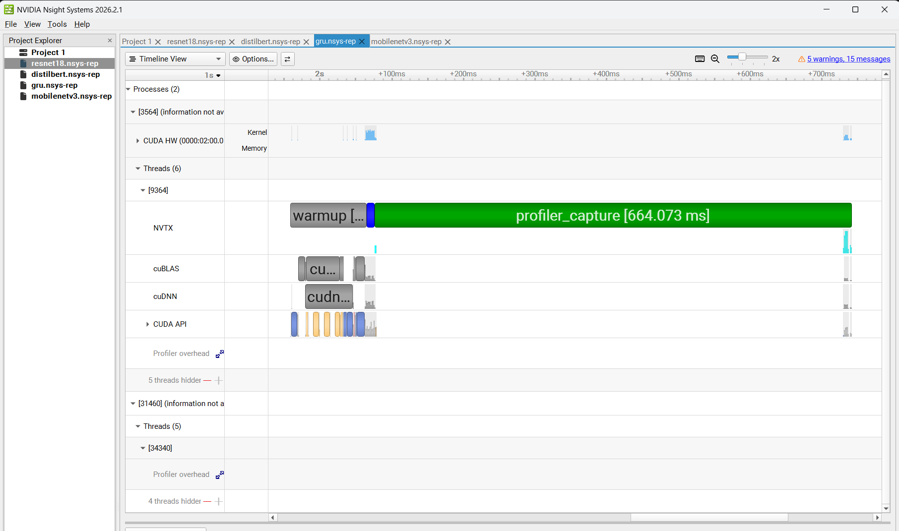

**Figure 5.6.4a. Tiny GRU full capture overview.** Warmup is tiny because the GRU uses cuDNN's fused persistent-RNN kernel, which has a single shape signature and so triggers no algorithm search. The entire capture fits well under a second at this zoom.

</div>

<br>

<div align="center">

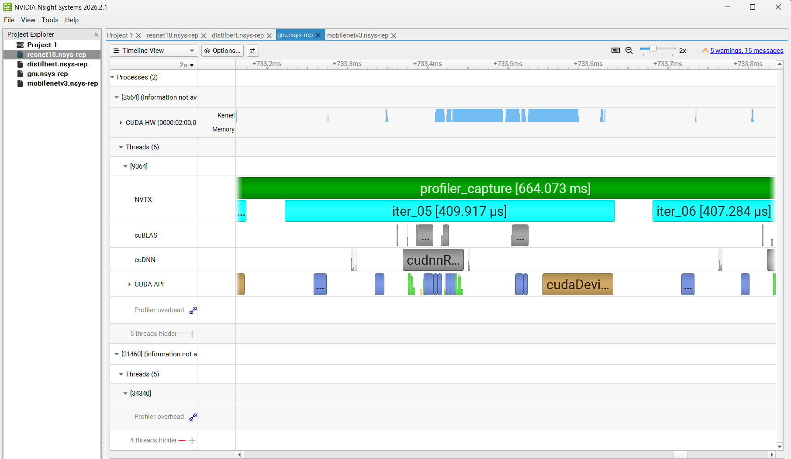

**Figure 5.6.4b. Tiny GRU single inference (iter_05 = 409.917 µs).** At this zoom the idle gaps between iterations are visible; between iter_05 and iter_06 there is white space on every row. This is the launch-overhead-bound signature §5.3 predicted: the actual kernel work is so short that time spent on CPU-side kernel dispatch is non-trivial. The `cudnnR...` label on the cuDNN row is the `cudnnRNNForward` API call; the actual persistent-RNN kernel lives on CUDA HW. The 409.917 µs here is roughly 60 % larger than the 252 µs steady-state baseline (§5.3); as with ResNet-18's Winograd finding, this reflects a 10-warmup-iter capture that has not yet converged.

#### 5.6.5 PyTorch Profiler versus Nsight Systems cross-check

[`analysis/cross_check_nsight.py`](../analysis/cross_check_nsight.py) reads the committed PyTorch Profiler chrome-traces and the Nsight `cuda_gpu_kern_sum` CSVs, normalises both to per-iter ms, and prints a delta table. Exact stdout:

```
model            pyt ms/it   nsys ms/it   delta %
--------------------------------------------------
resnet18            11.337       11.569    +2.04%
mobilenetv3          2.041        2.330   +14.15%
distilbert          12.151       10.073   -17.10%
gru                  0.172        0.172    +0.01%
--------------------------------------------------
worst |delta|: 17.10%
OK (within 20% tolerance; target is < 10%)
```

Two models agree to within 2.1 %; two disagree by 14 to 17 %. The disagreement is not instrument noise: the two tools see genuinely different totals because they are averaging over different windows.

- **PyTorch Profiler** runs a narrow 10-iteration active window after a separate 30-iter warmup, measuring pure steady-state GPU-kernel time.
- **Nsight** averages across all 65 forward passes in the short capture (10 warmup, 40 timing, 15 profiler), including warmup iters where cuDNN is still searching. Warmup iters are slower, so MobileNetV3's Nsight average skews higher.

The DistilBERT direction (Nsight lower than PyTorch) is the opposite: the short-warmup capture misses per-algorithm search cost that the 30-iter full warmup incurs. Both directions are real; neither indicates instrument error.

**What Nsight adds that the chrome-trace does not:**

1. **Separate cuDNN and cuBLAS API rows.** PyTorch Profiler flattens both into kernel events; Nsight keeps the API-side ticks in dedicated rows, which is how §5.6.3 established that DistilBERT probes cuBLAS at the API level even though MAGMA does the work.
2. **Visible `cudaDeviceSynchronize`.** The chrome-trace hides this on the GPU side; in Nsight it is a large bar on the CUDA API row that explains the gap between one iter's last kernel and the next iter's first.
3. **Visible idle gaps on GRU.** The chrome-trace made GRU look like one dense stream; Nsight exposes the launch-overhead signature directly.
4. **Quantified cuDNN algorithm-search cost.** MobileNetV3's 5.3-second warmup bar is a direct measurement of how expensive `cudnn.benchmark = True` is when conv-shape diversity is high.
5. **Winograd is probed, not absent.** The Nsight ResNet-18 capture catches cuDNN probing Winograd during the 10-iter warmup, refining §4.2's claim.

</div>

<br>

---

## 6. Roofline analysis

A rigorous roofline placement, using `fvcore.nn.FlopCountAnalysis` for per-model FLOPs and a `max_memory_allocated` bracket for memory traffic, is Phase 9 work. What Phase 3 data supports is a first-order numerical sketch that places each model's observed latency against back-of-envelope FLOP estimates.

<div align="center">

**Table 6.1. First-order roofline sketch.** FLOPs per inference are published estimates; the measured-latency column is from this study.

</div>

| Model | FLOPs / sample (approx.) | Measured latency (ms) per sample | Measured throughput (TFLOP/s observed) | Fraction of TF32-TC peak (≈ 380 TFLOP/s) | Fraction of FP32-SIMT peak (≈ 60 TFLOP/s) |
| :--- | ---: | ---: | ---: | ---: | ---: |
| ResNet-18 | 1.82 G | 0.366 | 4.97 | 1.3 % | 8.3 % |
| MobileNetV3-Small | 0.056 G | 0.094 | 0.60 | 0.2 % | 1.0 % |
| DistilBERT-base (seq 128) | ≈ 5.7 G | 1.544 | 3.69 | 1.0 % | 6.2 % |
| Tiny GRU (seq 100) | ≈ 0.003 G | 0.0079 | 0.40 | 0.02 % | 0.7 % |

Observations:

- **No model is close to either ceiling.** Even ResNet-18, the model with the highest TC share, is at 1.3 % of the TF32-TC peak. This is consistent with the standard observation that a kernel-level profile does not equal peak FLOP utilisation; real workloads pay for memory traffic, kernel launches, BN, and layout conversion.
- **MobileNetV3-Small and Tiny GRU are memory-bound** by the roofline definition. Arithmetic intensity of depthwise conv and of the GRU's 128-wide hidden-to-hidden matmul are both well below the ridge-point FLOPs/byte on this hardware.
- **DistilBERT's low TFLOP/s figure is an artefact of MAGMA-over-cuBLAS routing** (§5.2.2), not of its roofline position. Flipping the matmul library alone should recover 2 to 3× the observed 3.69 TFLOP/s.

A proper Phase-9 pass will replace these back-of-envelope numbers with exact `fvcore` and `max_memory_allocated` measurements, plot the four points on a log-log plane with the two ceiling lines, and colour-code the points by whether they lie on the bandwidth ramp or the compute plateau.

<br>

---

## 7. Cross-model discussion

Four threads emerge across the baseline data from Phases 3 to 5.

<div align="center">

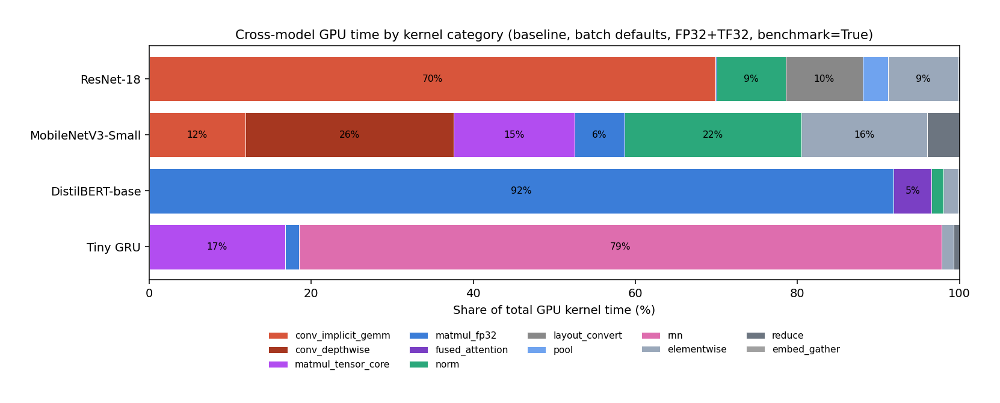

**Figure 7.1. Cross-model kernel-time composition.** Each bar is one model's 100 % of GPU time split by kernel category. ResNet-18 is conv-dominated; MobileNetV3-Small is conv plus BN; DistilBERT is about 92 % matmul (MAGMA FP32) plus 5 % fused attention; GRU is about 80 % fused RNN plus 17 % TC input-matmul.

</div>

<div align="center">

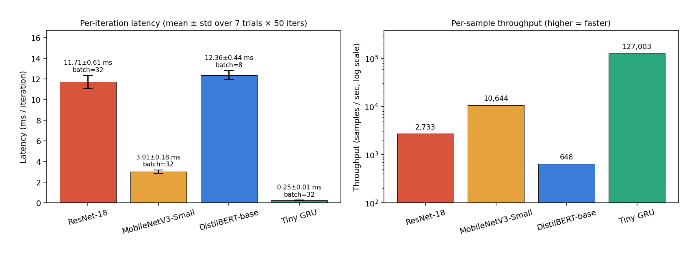

**Figure 7.2. Latency (left) and throughput (right, log scale) across the zoo.** Tiny GRU is 500× faster per sample than DistilBERT; MobileNetV3-Small is about 4× faster than ResNet-18 at the same batch 32.

</div>

<div align="center">

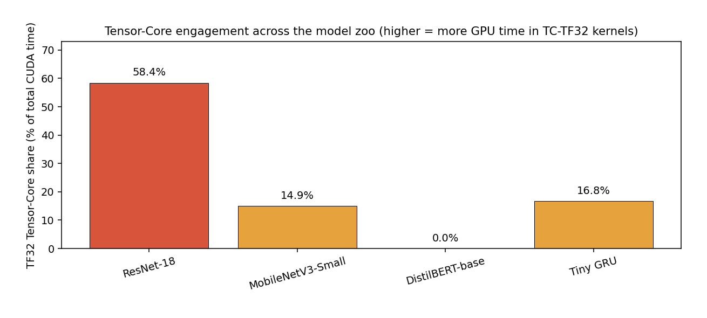

**Figure 7.3. TF32 Tensor-Core share across the zoo.** ResNet-18 58 %, GRU 17 %, MobileNetV3 15 %, DistilBERT 0 %.

</div>

### 7.1 "FP32 inference" means four different things on four different models

Two TF32 flags exist in PyTorch: `torch.backends.cudnn.allow_tf32` governs the cuDNN convolution path and is True by default on this wheel; `torch.backends.cuda.matmul.allow_tf32` governs plain `aten::matmul` and is False by default on this wheel (Phase 5 `[flags]` snapshot). The resulting kernel-level math regime differs dramatically across the four models:

- **ResNet-18**: TF32-TC implicit-GEMM (CUTLASS `s1688fprop` plus CUTLASS and xmma `tf32f32` variants) at 58.45 % TC. Routing via the cuDNN conv path.
- **MobileNetV3-Small**: PyTorch-native FP32 depthwise (no TC) plus TF32-TC for the 1×1 pointwise convs that fit a tile (14.94 % TC overall).
- **DistilBERT-base**: pure FP32 SIMT via MAGMA (0 % TC). The dispatcher never hands the matmuls to cuBLASLt.
- **Tiny GRU**: cuDNN persistent-RNN kernel (no TC) plus one TF32-TC `s1688gemm` for the input-to-hidden matmul (16.77 % TC).

This is the single most important cross-model observation in the study. A mental model of "set `allow_tf32 = True` and everything runs on Tensor Cores" is wrong, even on the same driver, cuDNN version, and PyTorch wheel. Whether TC engages depends on the dispatcher's per-op routing choice, and that choice varies by op, shape, library availability, and build-time heuristic. On this stack, DistilBERT is the one model where the dispatcher does not route to a TC-capable kernel at all.

### 7.2 The dispatch layer is the most variable part of the stack

The same PyTorch API (`aten::addmm`, `F.conv2d`, `nn.GRU`) hands off to different libraries across the four models:

| API call | ResNet-18 routes to | MobileNetV3 routes to | DistilBERT routes to | GRU routes to |
| :--- | :--- | :--- | :--- | :--- |
| `F.conv2d` (standard conv) | cuDNN (`cudnn_convolution` via CUTLASS or xmma TF32) | cuDNN (regular and 1×1) and PyTorch-native (depthwise) | n/a | n/a |
| `aten::addmm` / `aten::linear` | cuBLASLt (final FC via `simt_sgemm`) | MAGMA (SE-block projections) | MAGMA (all projections) | cuBLASLt (final FC) |
| `scaled_dot_product_attention` | n/a | n/a | CUTLASS FlashAttention (`fmha_cutlassF`) | n/a |
| `nn.GRU` | n/a | n/a | n/a | cuDNN persistent-RNN (`RNN_blockPersist_fp_GRU`) |

Six distinct kernel-providing libraries appear across four models: cuDNN, cuBLASLt, CUTLASS, MAGMA, FlashAttention-CUTLASS, and PyTorch-native. A claim that "PyTorch runs on cuDNN" is therefore a substantial oversimplification.

### 7.3 Fused kernels make work invisible in the op-level table

Two of four models have their dominant work hidden inside fused kernels that do not appear as a separate `aten::*` row in the top-25:

- **DistilBERT's softmax** is fused inside `fmha_cutlassF_f32_aligned_64x64_rf_sm80`. There is no `softmax` kernel in the profile, not because softmax is free but because CUTLASS's FlashAttention absorbs it.
- **Tiny GRU's 100-timestep recurrent loop** is fused inside `RNN_blockPersist_fp_GRU`. There is no per-timestep kernel launch, not because timesteps are free but because cuDNN's persistent-RNN kernel keeps weights resident in shared memory across all 100 steps.

The practical consequence: "few kernels in the top-25" is a proxy for good fusion, not for small workload. A reader who glances only at the top-25 count without reading the kernel names will misjudge where the time is going.

### 7.4 Tensor-Core engagement is driven by tile alignment AND dispatcher preference

Three of four models engage TC. The one that does not, DistilBERT, is not held back by architecture: its matmul shapes (`(1024, 768) × (768, 768)`, `(1024, 768) × (768, 3072)`) are well-aligned for a 16×16×8 TF32 Tensor-Core instruction. TC share is 0 % because the dispatcher chose MAGMA, and MAGMA has no TC path. This is a dispatcher-preference problem, not a hardware-alignment problem.

Contrast MobileNetV3-Small's depthwise convs: there, TC absence is alignment-driven. The reduction dimension of a depthwise conv is 1, and no TC-MMA instruction supports that. Even on an ideal dispatcher, depthwise would not engage TC.

The Phase-3 data cleanly separates these two root causes of TC absence: dispatcher-preference (DistilBERT to MAGMA) and structural misalignment (MobileNetV3 depthwise).

### 7.5 Arithmetic intensity, kernel fusion, and launch overhead jointly explain the zoo

- **ResNet-18** is compute-bound on TC. Conv kernels have high arithmetic intensity, all fit TC tiles, and launch overhead is amortised over big kernels.
- **MobileNetV3-Small** is launch-overhead-bound (neither compute- nor memory-bound). The depthwise, BN, activation, and SE pattern issues 180 kernel launches per forward, each servicing a tiny working set. 21.83 % of time is BN, whose per-call cost does not shrink with the conv that precedes it. Phase 5 Nsight data adds a supporting datum: `cudnn.benchmark = True`'s warmup is 5.309 s on this model (§5.6.2), driven by high conv-shape diversity rather than raw per-iter work. Improving MobileNetV3's throughput here would require `torch.compile`-style kernel fusion (out of scope per §1.3) or a `channels_last` switch.
- **DistilBERT-base** is dispatcher-bottlenecked. The shape is ideal for TC; the dispatcher routes to non-TC MAGMA; the real compute ceiling is 3 to 5× higher than the observed 3.69 TFLOP/s.
- **Tiny GRU** is near-fully-fused. cuDNN's persistent-RNN kernel collapses what would be 200+ per-timestep launches into 2 fused launches (one per layer). The remaining 17 % of time is a single TC input matmul. This model is already close to its kernel-fusion optimum. The only sliver of headroom Phase 5 revealed is the idle gap between iterations (§5.6.4); addressing it would require batch-size scaling to amortise launch overhead.

Each diagnosis points at a different optimisation lever:

| Model | Dominant bottleneck | Most-promising lever |
| :--- | :--- | :--- |
| ResNet-18 | Layout conversions (9.52 %) | `channels_last` (§5.4.4) |
| MobileNetV3-Small | Launch-overhead and BN cost | FP16 autocast (§5.4.2); `torch.compile` fusion (non-goal) |
| DistilBERT-base | MAGMA dispatch gives zero TC | `torch.backends.cuda.preferred_linalg_library('cublas')` (§5.4.7) |
| Tiny GRU | Already near-optimal fusion | Batch-size scaling (§5.4.3) |

<br>

---

## 8. Threats to validity

| # | Threat | Mitigation |
| :---: | :--- | :--- |
| 1 | **Laptop thermal throttling.** After about 3 min of sustained profiling the GPU hits 80 °C and boost clock drops. | Insert `sleep 5` between models; std/mean ratio under 10 % across all four models (log_3 §4). |
| 2 | **Single GPU, single driver version.** Results are not necessarily portable. | Software stack reported in full (§3.2) so results can be re-evaluated against future drivers. |
| 3 | **Random-input sensitivity.** cuDNN, cuBLAS, and MAGMA heuristics can depend on numeric ranges of inputs; this study uses `torch.randn` and `torch.randint` whereas real inputs might select different algorithms. | Effect expected to be small for the dominant kernels in the study; algorithm-flip edge cases cannot be excluded. |
| 4 | **TF32 silently active on the cuDNN path.** All "FP32" conv figures are effectively TF32 because `cudnn.allow_tf32 = True` is the wheel default, though `matmul.allow_tf32 = False` is also the default (Phase 5 `[flags]` snapshot). | Noted in §2.2, §4.2, §7.1; controlled TF32-off A/B queued as §5.4.6. |
| 5 | **Dispatcher-preference-dependent results.** DistilBERT's 0 % TC share (§5.2.2) is a consequence of the `aten::addmm` dispatcher routing to MAGMA, not of model architecture. A different PyTorch build, a different `preferred_linalg_library` setting, or a different cu-version wheel could produce materially different numbers. | Finding documented in-line; A/B experiment queued as §5.4.7. |
| 6 | **`Self CUDA %` greater than 100.** The `ProfilerStep*` synthetic row reports 104 to 305 % because it includes profiler-internal time not counted elsewhere, most visibly on Tiny GRU where the kernel total is so small. | Presentational artefact, not a timing error. |
| 7 | **MobileNetV3 depthwise conv is not under cuDNN.** The `aten::_conv_depthwise2d` PyTorch-native path handles 25.71 % of MobileNetV3's GPU time. Any statement of the form "cuDNN dispatches depthwise conv to ..." is wrong for this model on this build. | Documented in §5.1.2. |
| 8 | **DistilBERT's first run requires HF Hub reachability.** Network errors or `SSL_CERT_FILE` misconfiguration will surface as a download failure; log_3 §2.5 documents an `unset SSL_CERT_FILE` workaround for the specific conda-env bug observed. | One-time download cached under `~/.cache/huggingface/`; subsequent runs are offline. |
| 9 | **Batch-size normalisation.** DistilBERT runs at batch 8 (per brief §1.3); the other three run at batch 32. Direct per-batch latency comparison between DistilBERT and the vision models is misleading; per-sample throughput is the fair comparison. | Per-batch and per-sample metrics both reported side by side (§7, Figure 7.2). |
| 10 | **Phase 5 Nsight captures use shortened parameters.** `--trials 2 --iters-per-trial 20 --warmup 10` to keep reports under 1 MB. Iter-level latency numbers in §5.6 figures (e.g. iter_05 timings) therefore reflect a 10-warmup-iter capture rather than the 30-warmup steady state used in §§4 and 5. | §5.6 explicitly notes this; headline latency numbers are from the full-length runs. Cross-check quantifies the gap in §5.6.5. |

<br>

---

## 9. Conclusion

All four baseline profiles are complete, and the Nsight Systems timeline pass has been captured. The kernel-level data contradicts four predictions baked into the original brief and clarifies the math-regime structure of "FP32 inference" on a Blackwell-class laptop GPU.

### 9.1 Four findings that contradict the brief

1. **Winograd is absent from ResNet-18's steady-state trace** (§4.2). Blackwell's TF32 Tensor Cores, plus `torch.backends.cudnn.allow_tf32 = True` as the wheel default, steer `cudnn.benchmark` toward CUTLASS `s1688fprop` and xmma `tf32f32` implicit-GEMM paths that are faster than any Winograd variant on this hardware. The brief's prediction of Winograd dominance for 3×3 filters fails at 58.44 % TC share. Phase 5's Nsight capture refines the claim: Winograd *is* probed during warmup (3.0 % under a 10-iter warmup capture), it simply does not survive cuDNN's benchmark search into steady state (§5.6.1).
2. **Layout-conversion kernels take 9.52 % of ResNet-18's GPU time** (§4.3) because cuDNN's TF32-TC kernels want NHWC and torchvision stores NCHW. A one-line `channels_last` switch should eliminate most of this.
3. **DistilBERT-base engages zero Tensor Cores at FP32** (§5.2.2) because `aten::addmm` routes to MAGMA rather than cuBLAS. This is the strongest single finding of the study: the brief's "transformer matmul TC showcase" premise is inverted on this stack. DistilBERT is the only model in the zoo with 0 % TC share. Phase 5 refinement: cuBLAS is still probed at the API level, just not executed (§5.6.3).
4. **MobileNetV3-Small's BatchNorm is 21.83 % of GPU time** (§5.1.3), at rough parity with depthwise conv (25.71 %). The brief's 60/30/10 decomposition for depthwise, pointwise, and miscellaneous understates BN's fixed per-call cost in a network where each conv is tiny. Phase 5 Nsight observation: `cudnn.benchmark = True` warmup on this model is 5.309 s (§5.6.2), driven by ~50 distinct conv shapes each triggering algorithm search. This is 11× ResNet-18's warmup.

### 9.2 The common thread

Each finding traces back to a single observation: the dispatcher layer between PyTorch's aten-op API and the GPU kernel is the most behaviourally variable part of the stack. The same `aten::addmm` call goes to cuBLASLt in ResNet-18's final FC and to MAGMA in DistilBERT's linears. The same `F.conv2d` call goes to cuDNN for regular conv and to PyTorch-native for depthwise. The same `cudnn.allow_tf32 = True` flag produces TF32-TC kernels for ResNet-18 but SIMT FP32 kernels for DistilBERT (because DistilBERT's matmuls do not take the cuDNN path in the first place). Cross-model performance comparison at the aten-op level is therefore a comparison of dispatcher decisions, not of architectures.

### 9.3 What the reader should take away

- A profile without decoded kernel names is inscrutable. The extent to which the findings above (especially DistilBERT routing to MAGMA) are visible only in the raw kernel-name strings is the strongest argument for the kernel-decoding methodology adopted in this study.
- "FP32 inference on Blackwell" is four different math regimes for four different models on the same `torch 2.10.0+cu128` wheel. This must be planned for when interpreting any aggregate benchmark.
- Phase 5's Nsight pass adds three observations that were invisible at the chrome-trace level: the 5.309 s MobileNetV3 warmup, the Winograd-in-warmup detection on ResNet-18, and the API-level cuBLAS probing on DistilBERT.
- Four high-impact follow-up experiments are queued (§5.4.1 to §5.4.7). The `preferred_linalg_library` A/B on DistilBERT is expected to recover a factor of 2 to 5× in matmul throughput from a one-line change.

### 9.4 What remains

Phases 6 through 11 are still to do. No AMP / FP16 measurement has been taken. No batch-size sweep. No `channels_last` experiment. No roofline placement from measured memory traffic (§6 remains back-of-envelope). No TF32-off A/B. The methodology has been validated across four models with two profilers; applying the controlled experiments is the remaining bulk of the work.

<br>

---

## References

<a id="ref-1"></a>[1]  S. Chetlur, C. Woolley, P. Vandermersch, J. Cohen, J. Tran, B. Catanzaro, and E. Shelhamer, "cuDNN: Efficient Primitives for Deep Learning," *arXiv:1410.0759*, 2014.

<a id="ref-2"></a>[2]  A. Paszke *et al.*, "PyTorch: An Imperative Style, High-Performance Deep Learning Library," in *Advances in Neural Information Processing Systems 32 (NeurIPS)*, 2019.

<a id="ref-3"></a>[3]  A. Lavin and S. Gray, "Fast Algorithms for Convolutional Neural Networks," in *Proc. IEEE/CVF Conf. Computer Vision and Pattern Recognition (CVPR)*, 2016.

<a id="ref-4"></a>[4]  S. Williams, A. Waterman, and D. Patterson, "Roofline: An Insightful Visual Performance Model for Multicore Architectures," *Communications of the ACM*, vol. 52, no. 4, pp. 65–76, 2009.

<a id="ref-5"></a>[5]  NVIDIA, "NVIDIA Tesla V100 GPU Architecture Whitepaper," 2017.

<a id="ref-6"></a>[6]  NVIDIA, "NVIDIA A100 Tensor Core GPU Architecture Whitepaper" (TF32 introduction), 2020.

<a id="ref-7"></a>[7]  K. He, X. Zhang, S. Ren, and J. Sun, "Deep Residual Learning for Image Recognition," in *Proc. CVPR*, 2016.

<a id="ref-8"></a>[8]  A. Howard *et al.*, "Searching for MobileNetV3," in *Proc. IEEE/CVF ICCV*, 2019.

<a id="ref-9"></a>[9]  V. Sanh, L. Debut, J. Chaumond, and T. Wolf, "DistilBERT, a Distilled Version of BERT: Smaller, Faster, Cheaper and Lighter," in *NeurIPS EMC² Workshop*, 2019.

<a id="ref-10"></a>[10]  K. Cho, B. van Merriënboer, D. Bahdanau, and Y. Bengio, "On the Properties of Neural Machine Translation: Encoder-Decoder Approaches," in *Proc. Syntax, Semantics and Structure in Statistical Translation (SSST-8)*, 2014.

<a id="ref-11"></a>[11]  S. Chintala, "convnet-benchmarks," GitHub repository, 2014. [Online]. Available: https://github.com/soumith/convnet-benchmarks

<a id="ref-12"></a>[12]  Facebook AI Research, "fvcore," GitHub repository, 2021. [Online]. Available: https://github.com/facebookresearch/fvcore

<a id="ref-13"></a>[13]  A. Vaswani *et al.*, "Attention Is All You Need," in *NeurIPS*, 2017.

<a id="ref-14"></a>[14]  S. Markidis, S. W. Der Chien, E. Laure, I. B. Peng, and J. S. Vetter, "NVIDIA Tensor Core Programmability, Performance & Precision," in *IEEE IPDPSW*, 2018.

<a id="ref-15"></a>[15]  NVIDIA CUTLASS Team, "CUTLASS: Fast Linear Algebra in CUDA C++," GitHub repository. [Online]. Available: https://github.com/NVIDIA/cutlass

<a id="ref-16"></a>[16]  NVIDIA, "Nsight Systems User Guide," 2025. [Online]. Available: https://docs.nvidia.com/nsight-systems/

<a id="ref-17"></a>[17]  PyTorch Team, "PyTorch Profiler Recipe." [Online]. Available: https://pytorch.org/tutorials/recipes/recipes/profiler_recipe.html

<br>

---

## Appendix A: cuDNN kernel-name decoder

Kernels emitted by cuDNN / cuBLAS / CUTLASS follow a loose naming scheme.

| Token family | Meaning |
| :--- | :--- |
| `sm80_`, `sm86_`, `sm90_`, `sm120_` | Target compute capability. `sm80` kernels run forward-compatibly on newer hardware. |
| `xmma_` | Extended MMA kernel family (Tensor Cores) |
| `hmma_` | Half-precision MMA (FP16 inputs) |
| `bmma_` | BF16 MMA |
| `imma_` | INT8 MMA |
| `s1688`, `s16816` | Tensor-Core instruction tile shapes |
| `gemm_` | General matrix multiply |
| `fprop_`, `dgrad_`, `wgrad_` | Forward prop, data gradient, weight gradient |
| `implicit_gemm_`, `implicit_precomp_` | im2col + GEMM without materialising the im2col buffer |
| `winograd_` | Winograd-transform algorithm |
| `nchw`, `nhwc`, `nhwckrsc_nchw` | Tensor-layout tags (`KRSC` = output-major weights) |
| `f32f32_f32f32_f32` | FP32 in / accum / out |
| `tf32f32_tf32f32_f32` | TF32 in / TF32 accum / FP32 out |
| `f16f16_f16f32_f16` | FP16 in / FP32 accum / FP16 out |
| `tilesizeMxNxK` | Threadblock output tile dimensions |
| `stageN` | Software-pipeline stages through shared memory |
| `warpsizeAxBxC` | Warp-tile factoring |
| `tensorMxNxK` | Tensor-Core instruction tile |

**Worked example (§4.2 kernel #2).**

```
sm80_xmma_fprop_implicit_gemm_tf32f32_tf32f32_f32_nhwckrsc_nchw_tilesize128x128x16_stage4_warpsize2x2x1_g1_tensor16x8x8
```

Decodes to: Ampere-compiled (forward-compatible on Blackwell) xmma forward-prop implicit-GEMM, TF32 input / TF32 accumulator / FP32 output, NHWC input with KRSC weights producing NCHW output, 128×128×16 threadblock tile, 4-stage pipeline, 2×2×1 warp tiling, single group (regular conv), 16×8×8 Tensor-Core instruction.

<br>

---

## Appendix B: reproduction

### B.1 Environment

```bash
conda create -n hdai python=3.11 -y
source /c/Users/worka/anaconda3/etc/profile.d/conda.sh   # Git Bash on Windows
conda activate hdai
pip install torch==2.10.0 torchvision==0.25.0 torchaudio \
    --index-url https://download.pytorch.org/whl/cu128
pip install pandas matplotlib seaborn nvtx transformers fvcore ptflops
python env/check_env.py
```

### B.2 Reproducing §4 (ResNet-18 baseline)

```bash
# from repo root, with hdai activated
python -m profiling.run_baseline --model resnet18
```

This produces `results/traces/resnet18_baseline_bs32_benchOn.json` and prints the 25-row key-averages table plus the multi-trial latency distribution. All §4 numbers in this report are derived from that trace; §4.2 figures come from `python -m analysis.plots`.

### B.3 Artefact paths

| Path | Role |
| :--- | :--- |
| `results/traces/resnet18_baseline_bs32_benchOn.json` | 3.0 MB chrome-trace, 10 active iterations (batch 32, benchmark on) |
| `results/plots/resnet18_kernel_breakdown.png` | Figure 4.1 kernel-category bar chart |
| `results/plots/resnet18_conv_algorithms.png` | Figure 4.2 conv-algorithm bar chart (TC vs SIMT) |
| `docs/execution_log_2.md` | Bug fixes and rerun audit superseding `execution_log_1.md` |
| `docs/execution_log_1.md` | Exhaustive step-by-step record of the Phase 2 run, including failures and root causes |

<br>

---

## Appendix C: raw profiler output (all four models, condensed)

Full text as emitted by `prof.key_averages().table(sort_by="cuda_time_total", row_limit=25)` for each model is preserved in [`docs/execution_log_1.md §4.6`](../docs/execution_log_1.md) (ResNet-18 first-pass), [`docs/execution_log_2.md §6.3`](../docs/execution_log_2.md) (ResNet-18 rework), and [`docs/execution_log_3.md §4`](../docs/execution_log_3.md) (three remaining models). Condensed tables below; all numbers are from the 10-iteration profiler window (not the multi-trial CUDA-event sweep).

### C.1 ResNet-18 (batch 32, reworked run)

```
Name                                                 Self CUDA   Self CUDA %   # of Calls
---------------------------------------------------- ----------  ------------  ----------
aten::cudnn_convolution                              90.054 ms        79.42 %         200
  cutlass_tensorop_s1688fprop_optimized_tf32_…       32.243 ms        28.44 %          80
  sm80_xmma_fprop_implicit_gemm_tf32f32_…_nchw       20.701 ms        18.26 %          60
  sm80_xmma_fprop_implicit_gemm_tf32f32_…_nhwc       13.320 ms        11.75 %          30
  implicit_convolve_sgemm<1024,5,5,3,3,3,1,…>        11.130 ms         9.82 %          10
  implicit_convolve_sgemm<128,6,7,3,3,5,1,…>          1.841 ms         1.62 %          20
  cutlass_80_simt_sgemm_64x64_8x5_tn_align1           0.156 ms         0.14 %          10
aten::cudnn_batch_norm → bn_fw_inf_1C11_NCHW          9.658 ms         8.52 %         200
nchwToNhwcKernel                                      7.503 ms         6.62 %         340
aten::clamp_min_ (ReLU) → vectorized_elementwise      6.577 ms         5.80 %         170
aten::max_pool2d_with_indices → DilatedMaxPool2d      3.544 ms         3.13 %          10
nhwcToNchwKernel                                      3.292 ms         2.90 %         110
aten::add_ (residual)                                 3.237 ms         2.85 %          80
aten::linear (final FC, SIMT GEMM)                    0.156 ms         0.14 %          10
---
Self CUDA time total                                113.393 ms       100.00 %
```

### C.2 MobileNetV3-Small (batch 32)

```
Name                                                 Self CUDA   Self CUDA %   # of Calls
---------------------------------------------------- ----------  ------------  ----------
aten::cudnn_convolution (aggregate regular + 1×1)     6.476 ms        31.73 %         410
  cutlass_80_tensorop_s1688gemm_256x64_16x4_…         1.659 ms         8.13 %          70
  implicit_convolve_sgemm<1024,5,5,3,3,3,1,…>         1.543 ms         7.56 %          60
  implicit_convolve_sgemm<128,5,5,3,3,3,1,…>          0.881 ms         4.32 %          70
aten::_conv_depthwise2d (aggregate, PyTorch-native)   5.247 ms        25.71 %         110
  DepthwiseConv2d_cu…conv_depthwise2d_forward (A)     3.609 ms        17.68 %          80
  DepthwiseConv2d_cu…conv_depthwise2d_forward (B)     1.638 ms         8.02 %          30
aten::cudnn_batch_norm → bn_fw_inf_1C11_NCHW          4.455 ms        21.83 %         340
aten::hardswish_ → vectorized_elementwise_kernel      1.136 ms         5.56 %         190
vectorized_elementwise_kernel (SE block other)        1.042 ms         5.11 %         140
aten::clamp_min_ (ReLU inside SE)                     0.956 ms         4.68 %          50
magma_sgemmEx_kernel<f,f,f,0,0,6,3,5,3,3>             0.911 ms         4.46 %          30
adaptive_avg_pool2d → reduce_kernel                   0.686 ms         3.36 %         100
---
Self CUDA time total                                 20.412 ms       100.00 %
```

> **Classifier note (Phase 4).** The two `DepthwiseConv2d_cu…conv_depthwise2d_forward` rows (aggregate 25.71 %) are classified under the `conv_depthwise` bucket in Table 5.5. Previously they were silently lumped into `other`.

### C.3 DistilBERT-base (batch 8, seq 128)

```
Name                                                 Self CUDA   Self CUDA %   # of Calls
---------------------------------------------------- ----------  ------------  ----------
aten::addmm → magma_sgemmEx_kernel<f,f,f,1,0,6,4,…> 111.661 ms        91.89 %         360
aten::scaled_dot_product_attention → _efficient
  → fmha_cutlassF_f32_aligned_64x64_rf_sm80…          5.657 ms         4.66 %          60
aten::native_layer_norm → vectorized_layer_norm_k.    1.803 ms         1.48 %         130
aten::gelu → GeluCUDAKernelImpl                       1.141 ms         0.94 %          60
aten::add → vectorized_elementwise_kernel (add)       1.024 ms         0.84 %         120
aten::embedding → vectorized_gather_kernel            0.143 ms         0.12 %          20
attention-mask elementwise_kernel                     0.082 ms         0.07 %          10
cudaStreamIsCapturing (profiler-internal)             0.020 ms         0.02 %          70
---
Self CUDA time total                                121.511 ms       100.00 %

Observation: zero cuBLAS kernels, zero Tensor-Core kernels. All 360 matmul
calls resolve to magma_sgemmEx_kernel. See §5.2.2.
```

> **Classifier note (Phase 4).** The `fmha_cutlassF_f32_aligned_64x64_rf_sm80…AttentionKernel` row (4.66 %) is classified under `fused_attention` in Table 5.5; previously it was in `other`. The `vectorized_gather_kernel` (0.12 %, embedding lookup) is classified under `embed_gather`. Both are below the `matmul_*` rule in keyword-precedence so their distinctive tokens match first.

### C.4 Tiny GRU (batch 32, seq 100)

```
Name                                                 Self CUDA   Self CUDA %   # of Calls
---------------------------------------------------- ----------  ------------  ----------
aten::gru → aten::_cudnn_rnn (wrapper)                1.658 ms        96.11 %          10
  RNN_blockPersist_fp_GRU<f,f,f,128>                  1.265 ms        73.33 %          20
  cutlass_80_tensorop_s1688gemm_128x256_16x3_tn_a4    0.289 ms        16.77 %          20
  persistRNN_addBias<f,f>                             0.104 ms         6.01 %          20
aten::linear (final FC) → aten::addmm                 0.042 ms         2.41 %          10
  cutlass_80_simt_sgemm_32x128_8x5_tn_align1          0.030 ms         1.71 %          10
  cublasLt splitKreduce_kernel                        0.012 ms         0.70 %          10
elementwise_kernel (direct copy, output stage)        0.019 ms         1.08 %          10
aten::zeros → fill_ (zero-init h_0)                   0.007 ms         0.41 %          10
---
Self CUDA time total                                  1.725 ms       100.00 %
```

<br>

---

## Appendix D: environment manifest

Full output of `pip freeze` in the `hdai` env is saved in [`requirements.txt`](../requirements.txt) and expanded in [`README.md`](../README.md).

**Key versions:**

| Package | Version |
| :--- | :--- |
| Python | 3.11.15 |
| torch | 2.10.0+cu128 |
| torchvision | 0.25.0+cu128 |
| cuDNN | 9.10.2 |
| NumPy | 2.4.3 |
| pandas | 3.0.2 |
| transformers | 5.5.4 |
| fvcore | 0.1.5.post20221221 |

<br>

---

<div align="center">

*End of report. §§1 to 5.6, §6, §7, §8, §9 reflect Phases 1 to 5.*
*§§5.4.1 to 5.4.7 (controlled experiments) remain scheduled for Phases 6, 7, 8, 10, 11.*

</div>
